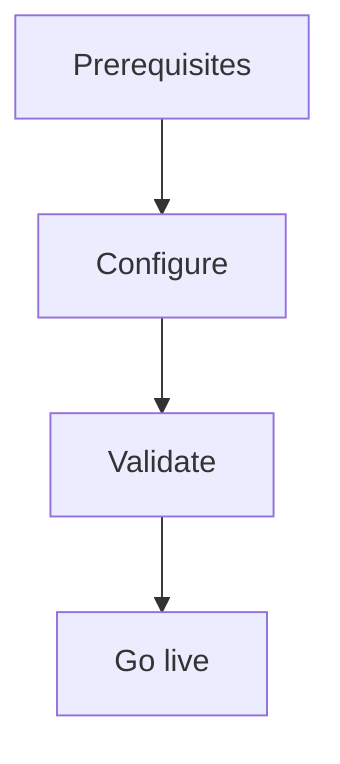

import {
  InfoBox,
  Warning,
  RelatedTopics,
  FaqAccordion,
  WorkflowCard,
} from '@site/src/components';

# Connect REST APIs

**Connect REST APIs** — Create workspace Business Tools that call your HTTPS APIs.

## Introduction

Follow this guide using the Admin Console at [app.qefro.com](https://app.qefro.com) and APIs on [api.qefro.com](https://api.qefro.com).

## Why it exists

Guides encode the recommended path so teams avoid insecure shortcuts.

## Concepts

See linked platform pages for definitions used in this guide.

## Architecture

In Admin Console, open a workspace → create a REST Business Tool (method, URL template, encrypted auth). Test via `POST /api/v1/tools/:id/test`.

## Workflow

<WorkflowCard title="REST tool" steps={[
  {title: 'HTTPS endpoint', description: 'Public or allowlisted API.'},
  {title: 'Create tool', description: 'Workspace tools API/UI.'},
  {title: 'Store secret', description: 'Encrypted credentials.'},
  {title: 'Test + logs', description: '/test and /logs.'},
]} />

## Security notes

<Warning>
URLs are SSRF-checked. Private IPs and link-local targets are blocked.
</Warning>

## Related topics

<RelatedTopics topics={[
  {label: 'Business Tools', to: '/docs/platform/business-tools'},
  {label: 'Import OpenAPI', to: '/docs/guides/import-openapi'},
]} />

