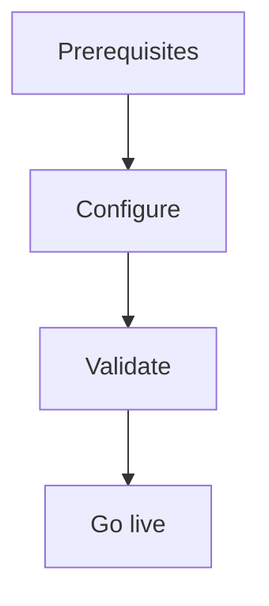

import {
  InfoBox,
  Warning,
  RelatedTopics,
  FaqAccordion,
  WorkflowCard,
} from '@site/src/components';

# Create Employee AI

**Create Employee AI** — Stand up Internal Portal with RBAC-scoped workspaces.

## Introduction

Follow this guide using the Admin Console at [app.qefro.com](https://app.qefro.com) and APIs on [api.qefro.com](https://api.qefro.com).

## Why it exists

Guides encode the recommended path so teams avoid insecure shortcuts.

## Concepts

See linked platform pages for definitions used in this guide.

## Architecture

Create internal workspaces (HR/IT), configure teams, and share `your-company.qefro.com`.

## Workflow

<WorkflowCard title="Employee AI" steps={[
  {title: 'Portal slug', description: 'Settings → ensure slug available.'},
  {title: 'Internal workspaces', description: 'Separate from Customer Support.'},
  {title: 'Teams + grants', description: 'Organization RBAC.'},
  {title: 'Invite members', description: 'Team invite flow.'},
]} />

## Security notes

<InfoBox>
Members only see granted workspaces; Owners/Admins see all.
</InfoBox>

## FAQ

<FaqAccordion items={[
  {question: 'Custom domain?', answer: 'See Enable Custom Domains guide.'},
]} />

## Related topics

<RelatedTopics topics={[
  {label: 'Employee AI', to: '/docs/platform/employee-ai'},
  {label: 'Internal Portal', to: '/docs/platform/internal-portal'},
  {label: 'RBAC', to: '/docs/platform/rbac'},
]} />

