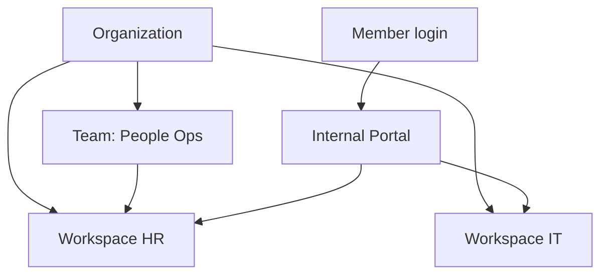

import {
  InfoBox,
  Warning,
  RelatedTopics,
  FaqAccordion,
  WorkflowCard,
} from '@site/src/components';

# Create Employee AI

This guide ships **Employee AI**: authenticated organization members use the [Internal Portal](/docs/platform/internal-portal) to chat with workspaces they are granted — not the public widget.

## Outcome

- One or more internal workspaces (HR, IT, Ops, …)
- Members invited and placed in Teams
- Workspace grants so Members only see allowed assistants
- Portal reachable on `your-company.qefro.com` (or a custom domain later)

## Prerequisites

- Owner or Admin on [app.qefro.com](https://app.qefro.com)
- Internal documents approved for employee access
- Decision on who may configure tools for customer channels (usually Admins only)

## Architecture

## Step 1 — Create internal workspaces

Create separate workspaces per audience (HR vs IT). Do **not** reuse the public Support workspace.

Background: [Employee AI](/docs/platform/employee-ai), [What is an AI Workspace?](/docs/concepts/what-is-an-ai-workspace).

## Step 2 — Ingest internal knowledge

Upload runbooks and policies that employees are allowed to see. Re-test citations and refusals the same way you would for Customer AI.

## Step 3 — Configure RBAC

1. Invite users (email/password signup + verification flow).
2. Create a Team (e.g. People Ops).
3. Add Members to the Team.
4. Attach the HR workspace to that Team.

Owners and Admins can typically access all workspaces; Members only see grants. Guide: [Configure RBAC](/docs/guides/configure-rbac). Platform: [RBAC](/docs/platform/rbac), [Teams](/docs/platform/teams).

## Step 4 — Brand and open the portal

1. Set logo/colors under Branding.
2. Note your `*.qefro.com` portal hostname.
3. Have a Member sign in and confirm they only see granted workspaces.

Optional later: [Enable Custom Domains](/docs/guides/enable-custom-domains).

## Step 5 — Business Tools (customer channels only)

In V1, Business Tool execution is **not** available from the Internal Portal. Configure tools for Website Widget and WhatsApp if needed; the portal stays a knowledge assistant.

See [Business Tools](/docs/platform/business-tools) and [Secure Business Actions](/docs/guides/secure-business-actions).

## Workflow checklist

<WorkflowCard
  title="Employee AI launch"
  steps={[
    {title: 'Create HR/IT workspaces', description: 'Separate from Support.'},
    {title: 'Ingest internal docs', description: 'Cite-test with employees.'},
    {title: 'Teams + grants', description: 'Members only see allowed workspaces.'},
    {title: 'Brand portal', description: 'Logo, colors, hostname.'},
    {title: 'Knowledge Q&A', description: 'Portal is RAG-only for Business Actions in V1.'},
  ]}
/>

<Warning>
Employee AI is not “Customer AI behind a login.” It requires membership, Teams, and workspace grants. See Customer AI vs Employee AI.
</Warning>

## FAQ

<FaqAccordion
  items={[
    {
      question: 'Can customers use the Internal Portal?',
      answer:
        'No. The portal is for organization members. Customers use the widget or WhatsApp.',
    },
    {
      question: 'How do I restrict a contractor?',
      answer:
        'Invite as Member, put them on a Team that only grants the workspaces they need.',
    },
  ]}
/>

## Related topics

<RelatedTopics
  topics={[
    {label: 'Employee AI', to: '/docs/platform/employee-ai'},
    {label: 'Internal Portal', to: '/docs/platform/internal-portal'},
    {label: 'Customer AI vs Employee AI', to: '/docs/concepts/customer-ai-vs-employee-ai'},
    {label: 'Configure RBAC', to: '/docs/guides/configure-rbac'},
    {label: 'Enable Custom Domains', to: '/docs/guides/enable-custom-domains'},
    {label: 'Branding', to: '/docs/platform/branding'},
  ]}
/>
