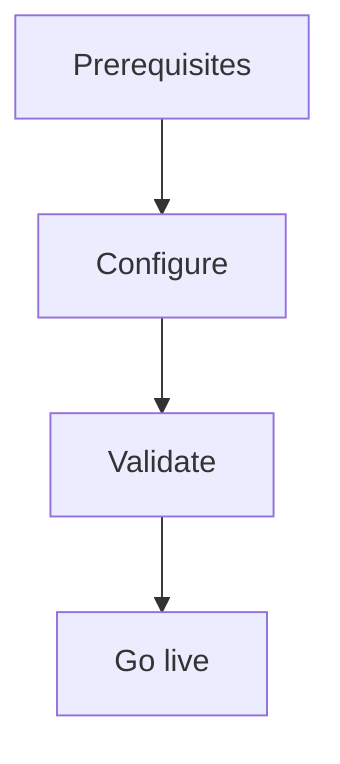

import {
  InfoBox,
  Warning,
  RelatedTopics,
  FaqAccordion,
  WorkflowCard,
} from '@site/src/components';

# Deploy Website Widget


**Deploy Website Widget** — Embed cdn.qefro.com/widget.js with token and workspace id.

## Introduction

Follow this guide using the Admin Console at [app.qefro.com](https://app.qefro.com) and APIs on [api.qefro.com](https://api.qefro.com).

## Why it exists

Guides encode the recommended path so teams avoid insecure shortcuts.

## Concepts

See linked platform pages for definitions used in this guide.

## Architecture




## Workflow

<WorkflowCard title="Embed" steps={[
  {title: 'Copy snippet', description: 'Admin Console → Widget.'},
  {title: 'Set workspace', description: 'data-workspace-id.'},
  {title: 'Optional identify', description: 'After your app login.'},
  {title: 'Verify WS', description: 'Chat streams over /ws/chat.'},
]} />

```html
<script
  src="https://cdn.qefro.com/widget.js"
  data-token="YOUR_WIDGET_TOKEN"
  data-endpoint="https://api.qefro.com"
  data-workspace-id="YOUR_WORKSPACE_ID">
</script>
```

## Related topics

<RelatedTopics topics={[
  {label: 'Website Widget', to: '/docs/platform/website-widget'},
  {label: 'Identity Forwarding', to: '/docs/platform/identity-forwarding'},
]} />


