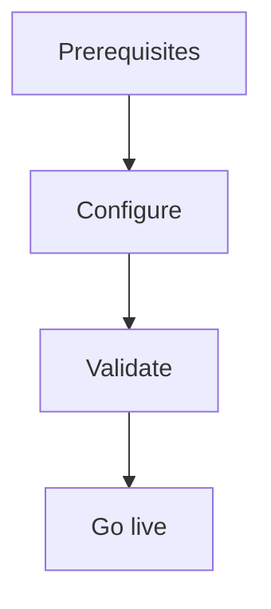

import {
  InfoBox,
  Warning,
  RelatedTopics,
  FaqAccordion,
  WorkflowCard,
} from '@site/src/components';

# Deploy WhatsApp AI


**Deploy WhatsApp AI** — Connect Meta Cloud API to /api/v1/whatsapp/webhook on Growth+.

## Introduction

Follow this guide using the Admin Console at [app.qefro.com](https://app.qefro.com) and APIs on [api.qefro.com](https://api.qefro.com).

## Why it exists

Guides encode the recommended path so teams avoid insecure shortcuts.

## Concepts

See linked platform pages for definitions used in this guide.

## Architecture




## Workflow

<WorkflowCard title="WhatsApp" steps={[
  {title: 'Growth+ plan', description: 'Required for WhatsApp.'},
  {title: 'Meta app', description: 'Cloud API + webhook URL.'},
  {title: 'Verify GET webhook', description: 'Meta challenge.'},
  {title: 'Map workspace', description: 'Admin Console WhatsApp settings.'},
]} />

```text
https://api.qefro.com/api/v1/whatsapp/webhook
```

## Related topics

<RelatedTopics topics={[
  {label: 'WhatsApp', to: '/docs/platform/whatsapp'},
  {label: 'Customer AI', to: '/docs/platform/customer-ai'},
]} />


