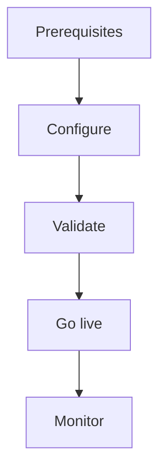

import {
  InfoBox,
  Warning,
  RelatedTopics,
  FaqAccordion,
  WorkflowCard,
} from '@site/src/components';

# Deploy WhatsApp AI

**Deploy WhatsApp AI** is a practical guide: Connect WhatsApp to a Customer AI workspace.

## Introduction

Follow this guide to connect whatsapp to a customer ai workspace. using the Qefro Admin Console and documented APIs.

## Why it exists

Guides encode the recommended path so teams avoid insecure shortcuts and incomplete go-lives.

## Concepts

- Prerequisites (plan, roles, workspace)
- Configuration steps
- Validation and rollback

## Architecture

Guide steps map to Admin Console configuration and optional API calls.



## Workflow

<WorkflowCard
  title="Deploy WhatsApp AI"
  steps={[
    {title: 'Prerequisites', description: 'Confirm plan limits, Owner/Admin access, and target workspace.'},
    {title: 'Configure', description: 'Apply settings described in this guide.'},
    {title: 'Validate', description: 'Run test conversations and permission checks.'},
    {title: 'Go live', description: 'Enable channels or publish portal access.'},
  ]}
/>

## Code examples

```bash
# Example curl pattern against the API host
curl -sS -H "Authorization: Bearer $TOKEN" \
  https://api.qefro.com/api/v1/health
```

```javascript
// Widget snippet placeholder — replace with your workspace keys from the console
window.QefroWidget?.init({ workspaceId: 'YOUR_WORKSPACE_ID' });
```

## Best practices

- Keep a staging workspace for experiments
- Record owners and runbooks before production
- Re-test after every OpenAPI/tool change

## Security notes

<InfoBox>
Prefer encrypted secrets in Business Tools. Never paste production credentials into chat transcripts or screenshots.
</InfoBox>

## FAQ

<FaqAccordion items={[
  {
    "question": "How long does this take?",
    "answer": "Typically 30–90 minutes depending on knowledge volume and API readiness."
  },
  {
    "question": "What if validation fails?",
    "answer": "Disable the channel, fix knowledge/tools, and re-test before re-enabling."
  }
]} />

## Related topics

<RelatedTopics topics={[
  {
    "label": "Quick Start",
    "to": "/docs/getting-started/quick-start"
  },
  {
    "label": "Business Tools",
    "to": "/docs/platform/business-tools"
  },
  {
    "label": "RBAC",
    "to": "/docs/platform/rbac"
  },
  {
    "label": "Security Overview",
    "to": "/docs/security/overview"
  }
]} />

