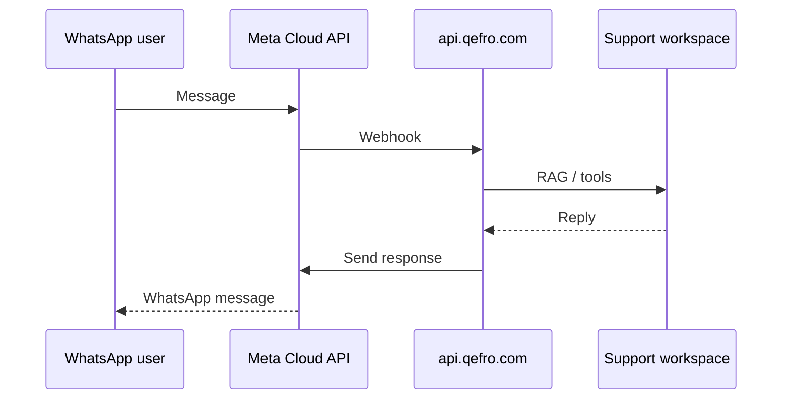

import {
  InfoBox,
  Warning,
  RelatedTopics,
  FaqAccordion,
  WorkflowCard,
} from '@site/src/components';

# Deploy WhatsApp AI

This guide enables **Customer AI on WhatsApp** using Meta Cloud API and Qefro’s WhatsApp webhook endpoints.

## Outcome

- WhatsApp channel configured for your organization
- Webhook verification succeeding against `api.qefro.com`
- Conversations bound to your Support workspace
- Parity checks against website widget answers

## Prerequisites

- **Growth plan or higher** (WhatsApp is plan-gated)
- Meta Business / Cloud API app with a phone number
- Support workspace already cite-tested on the website
- Owner/Admin access

Platform: [WhatsApp](/docs/platform/whatsapp).

## Architecture

## Step 1 — Confirm plan and workspace

1. Confirm WhatsApp is available on your plan in Billing.
2. Choose the **same** Support workspace used by the website widget (recommended for consistency).

## Step 2 — Configure Meta Cloud API

1. Create/select a Meta app with WhatsApp product.
2. Note phone number id, business account id, and access token (store the token as a secret in Qefro — not in git).
3. Prepare the webhook callback URL and verify token as shown in Admin Console → WhatsApp (source of truth for the exact path).

Typical Qefro webhook base: `https://api.qefro.com/api/v1/whatsapp/webhook` (confirm in console if paths evolve).

## Step 3 — Connect in Admin Console

1. Open WhatsApp settings for the organization/workspace mapping.
2. Paste Meta credentials into encrypted fields.
3. Complete webhook verification (Meta challenges Qefro; Qefro responds with the verify token).

## Step 4 — Send test messages

| Test | Expected |
| --- | --- |
| Known FAQ | Grounded answer + consistent with website |
| Unknown topic | Refusal / safe fallback |
| Tool-backed question | Only if tools enabled; check logs |

## Step 5 — Operational readiness

- Train support staff on escalation paths
- Monitor conversation analytics and tool logs
- Document opt-out / business hours policy for WhatsApp
- Tell users they can type `/new` or `/clear` to start a fresh thread (WhatsApp has no “+” button)

## Conversation commands

| Command | Description |
| --- | --- |
| `/new` | Archive the current thread and start a new conversation |
| `/clear` | Alias of `/new` |
| `/help` | List commands |

Commands are handled before AI/RAG/tools. WhatsApp replies may also show **Interactive Reply Buttons** (New Chat, Help) with automatic text fallback — see [WhatsApp](/docs/platform/whatsapp#interactive-reply-buttons).

## Workflow checklist

<WorkflowCard
  title="WhatsApp launch"
  steps={[
    {title: 'Website quality first', description: 'Do not multiply a weak corpus.'},
    {title: 'Confirm Growth+', description: 'WhatsApp entitlement.'},
    {title: 'Meta + webhook verify', description: 'Encrypted tokens in Qefro.'},
    {title: 'Bind Support workspace', description: 'Same as widget when possible.'},
    {title: 'Pilot users', description: 'Then expand marketing CTAs.'},
  ]}
/>

<Warning>
WhatsApp messages may include PII. Align retention and tool design with your privacy policy before broad rollout.
</Warning>

## FAQ

<FaqAccordion
  items={[
    {
      question: 'Can WhatsApp use a different workspace than the website?',
      answer:
        'Yes, but consistency usually suffers. Prefer one Support workspace unless you have a deliberate split.',
    },
    {
      question: 'Why is verification failing?',
      answer:
        'Check verify token match, HTTPS URL exactness, and that the Meta app points at the Qefro webhook path from the console.',
    },
  ]}
/>

## Related topics

<RelatedTopics
  topics={[
    {label: 'WhatsApp', to: '/docs/platform/whatsapp'},
    {label: 'Deploy Website Widget', to: '/docs/guides/deploy-website-widget'},
    {label: 'Webhooks', to: '/docs/api/webhooks'},
    {label: 'Customer AI', to: '/docs/platform/customer-ai'},
    {label: 'Production Deployment', to: '/docs/guides/production-deployment'},
    {label: 'Tutorial: widget to WhatsApp', to: '/blog/widget-to-whatsapp'},
  ]}
/>
