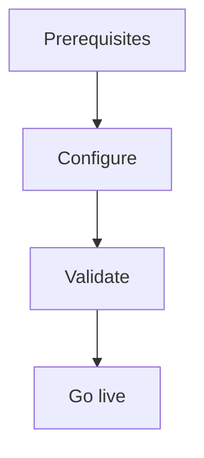

import {
  InfoBox,
  Warning,
  RelatedTopics,
  FaqAccordion,
  WorkflowCard,
} from '@site/src/components';

# Enable Custom Domains

**Enable Custom Domains** — CNAME your portal hostname to Cloudflare (org.qefro.com target).

## Introduction

Follow this guide using the Admin Console at [app.qefro.com](https://app.qefro.com) and APIs on [api.qefro.com](https://api.qefro.com).

## Why it exists

Guides encode the recommended path so teams avoid insecure shortcuts.

## Concepts

See linked platform pages for definitions used in this guide.

## Architecture

## Workflow

<WorkflowCard title="Custom domain" steps={[
  {title: 'Add hostname', description: 'Admin Console → Custom Domain.'},
  {title: 'DNS CNAME', description: 'Point to shown target (default org.qefro.com).'},
  {title: 'Wait for TLS', description: 'Complete verification.'},
]} />

## Related topics

<RelatedTopics topics={[
  {label: 'Custom Domains', to: '/docs/platform/custom-domains'},
  {label: 'Internal Portal', to: '/docs/platform/internal-portal'},
]} />

