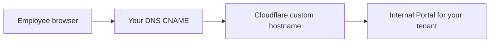

import {
  InfoBox,
  Warning,
  RelatedTopics,
  FaqAccordion,
  WorkflowCard,
} from '@site/src/components';

# Enable Custom Domains

This guide puts the **Internal Portal** on a hostname you own (for example `ai.yourcompany.com`) instead of only `your-company.qefro.com`.

## Outcome

- Custom hostname registered for your tenant portal
- DNS CNAME in place
- TLS healthy
- Employees sign in on your domain

## Prerequisites

- Employee AI portal already working on the default `*.qefro.com` host ([Create Employee AI](/docs/guides/create-employee-ai))
- Ability to create DNS records for your domain
- Owner/Admin access

Platform: [Custom Domains](/docs/platform/custom-domains).

## How it works (conceptual)

Qefro uses Cloudflare custom hostnames so your domain terminates TLS and routes to the Internal Portal for your tenant.



## Step 1 — Choose the hostname

Examples: `ai.example.com`, `portal.example.com`. Avoid overlapping with marketing apex if that complicates DNS.

## Step 2 — Start domain setup in Admin Console

1. Open Custom Domains (or Portal domains) settings.
2. Enter the hostname.
3. Copy the **CNAME target** shown in the console (often a Qefro / Cloudflare target such as an `org.qefro.com`-style hostname — use the value the console displays).

## Step 3 — Create DNS

At your DNS provider:

```text
ai.example.com  CNAME  <target-from-admin-console>
```

Wait for propagation.

## Step 4 — Complete verification / TLS

1. Return to Admin Console and refresh status.
2. Wait until the domain shows active / TLS ready.
3. Open `https://ai.example.com` and sign in as a Member.

## Step 5 — Communicate the URL

Update internal bookmarks and IdP “app” links (when you use SSO in the future) to the custom host.

## Workflow checklist

<WorkflowCard
  title="Custom domain go-live"
  steps={[
    {title: 'Portal works on *.qefro.com', description: 'Fix RBAC before DNS.'},
    {title: 'Add hostname in console', description: 'Copy CNAME target.'},
    {title: 'Create DNS CNAME', description: 'Propagate.'},
    {title: 'Wait for TLS active', description: 'Then smoke-test login.'},
    {title: 'Announce URL', description: 'Update internal docs.'},
  ]}
/>

<Warning>
A custom domain still maps to **one tenant**. Do not point multiple customers’ brands at a shared org.
</Warning>

## FAQ

<FaqAccordion
  items={[
    {
      question: 'Can the marketing site use this?',
      answer:
        'This guide is for the Internal Portal. Marketing (qefro.com) and docs (docs.qefro.com) are separate properties.',
    },
    {
      question: 'Apex domain (@) as portal?',
      answer:
        'Prefer a subdomain. Apex CNAMEs are awkward at many DNS providers.',
    },
  ]}
/>

## Related topics

<RelatedTopics
  topics={[
    {label: 'Custom Domains', to: '/docs/platform/custom-domains'},
    {label: 'Internal Portal', to: '/docs/platform/internal-portal'},
    {label: 'Branding', to: '/docs/platform/branding'},
    {label: 'Create Employee AI', to: '/docs/guides/create-employee-ai'},
    {label: 'Tenant Isolation', to: '/docs/security/tenant-isolation'},
  ]}
/>
