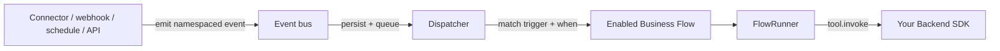
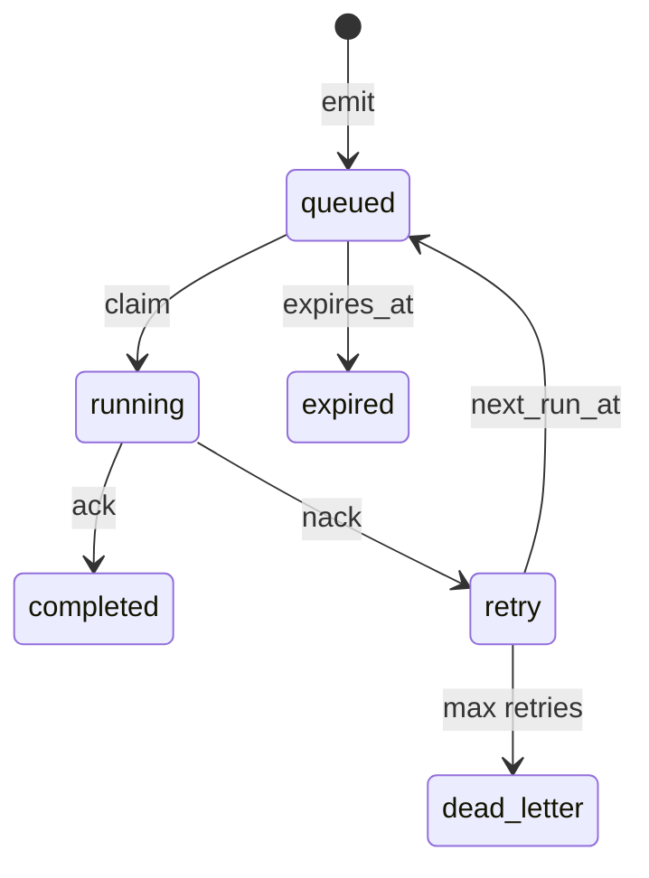

import {
  InfoBox,
  Warning,
  RelatedTopics,
  FaqAccordion,
  WorkflowCard,
  ApiEndpointCard,
} from '@site/src/components';

# Event-Driven Triggers

[Define Business Flows](/docs/guides/define-business-flows) and [Run Business Flows](/docs/guides/run-business-flows) cover conversation-driven flows: a customer message matches `intent`, and the Runtime starts a run.

**Event-driven triggers** are an *additional entry path into the same Runtime*. A connector, schedule, webhook, or your backend emits a namespaced event; the bus validates and queues it; the dispatcher matches enabled flows whose `metadata.trigger` matches; then **FlowRunner** runs the flow — with the same steps, tools, approvals, delays, and challenges as chat.

<InfoBox>
Events are **triggers only**. Connectors and external systems must never start flows themselves or embed a second orchestrator. They only <code>emit()</code>. The Qefro Runtime remains the single execution engine.
</InfoBox>

## Outcome

- Flows declared with `trigger: { type: 'event' | 'schedule' | 'webhook', ... }`
- Connectors (or Admin API) emit namespaced events into the bus
- Matching flows start as `Channel::Event` runs visible in **Flow Runs**
- Production safeguards: versioning, lineage, ordering, expiration, replay, loop depth, `when` predicates

## Prerequisites

- SDK Connection with tools + flows: [Register SDK Business Tools](/docs/guides/register-sdk-business-tools)
- `@qefro-ai/backend` ≥ **1.3.0** (or equivalent Python / Rust SDK with `trigger` support)
- Owner/Admin JWT for emit / list / replay APIs
- Optional: Qefro connector-kit `EventEmitter` for connector services

## Architecture



| Layer | Responsibility |
| --- | --- |
| Producer (connector, cron, HTTP) | Build envelope, call emit/ingest — **no FlowRunner** |
| Event bus | Validate name/namespace/depth/sequence, persist, idempotency, queue |
| Dispatcher | Claim due events, match flows, apply `when`, start runs |
| FlowRunner | Same engine as conversation flows (ask, tool, approval, delay, …) |

## Trigger types

Set `metadata.trigger` on `app.flow(...)`. Default (omit `trigger`) is **conversation** — Phase 2 behaviour.

| `type` | When it starts | Key fields |
| --- | --- | --- |
| `conversation` | Customer message matches `intent` | *(default)* |
| `event` | Bus event name equals `event` | `event` (required, namespaced), `when?` |
| `schedule` | Cron ticker emits `schedule.<flow_id>` | `cron` (required) |
| `webhook` | Named webhook ingest | `name?`, `when?` |

### TypeScript

```ts
app
  .flow({
    id: 'abandoned_cart_recovery',
    name: 'Abandoned cart recovery',
    version: 1,
    trigger: {
      type: 'event',
      event: 'shopify.cart.abandoned',
      // optional payload predicate
      // when: 'cart.total >= 50',
    },
    inputs: ['cartId'],
  })
  .delay({ id: 'wait_1h', duration_seconds: 3600 })
  .tool({ id: 'remind', tool_ref: 'send_cart_reminder' })
  .complete({ id: 'done', message: 'Cart reminder sent.' });
```

### Python

```python
(
    app.flow({
        "id": "abandoned_cart_recovery",
        "name": "Abandoned cart recovery",
        "trigger": {
            "type": "event",
            "event": "shopify.cart.abandoned",
            "when": "cart.total >= 50",  # optional
        },
    })
    .delay("wait_1h", duration_seconds=3600)
    .tool("remind", tool_ref="send_cart_reminder")
    .complete("done", message="Cart reminder sent.")
)
```

### Rust

```rust
use qefro_backend_sdk::{BusinessFlowMetadata, FlowTrigger};

app.flow(BusinessFlowMetadata {
    id: "abandoned_cart_recovery".into(),
    name: Some("Abandoned cart recovery".into()),
    trigger: Some(FlowTrigger::Event {
        event: "shopify.cart.abandoned".into(),
        when: None,
    }),
    ..Default::default()
})?
.delay("wait_1h", 3600)
.tool("remind", "send_cart_reminder")
.complete("done", Some("Cart reminder sent.".into()))?;
```

### Schedule trigger

```ts
app.flow({
  id: 'nightly_reconciliation',
  name: 'Nightly reconciliation',
  trigger: { type: 'schedule', cron: '0 2 * * *' },
})
  .tool({ id: 'run', tool_ref: 'reconcile_orders' })
  .complete({ id: 'done' });
```

On **Sync Tools**, the Runtime upserts a tenant schedule. The ticker emits `schedule.<flow_id>` (already namespaced). Dispatch resolves the flow via the event name **and** `payload.flow_id`.

### Optional `when` predicate

For `event` and `webhook` triggers, `when` is evaluated against the **event payload** (same expression style as flow `condition` steps):

```text
path OP literal | path exists | path empty | bare path (truthy)
OP := == | != | >= | <= | > | <
```

Examples: `total >= 1000`, `status == "paid"`, `customer.email exists`.

- Missing / empty `when` → always matches.
- Expression false → that flow is **skipped** (other matching flows may still run).
- Unparseable expressions fail closed for that flow.

## Event names and namespaces

Every event name **must** be fully qualified: `namespace.rest` (at least one `.`).

| Rule | Detail |
| --- | --- |
| Required dot | `shopify.order.created` ✅ · `order_created` ❌ |
| Segments | Non-empty; `a-zA-Z0-9_-` only |
| Max length | 256 characters |
| Namespace | First segment (`shopify`, `system`, `schedule`, …) |

**Well-known namespaces** (conventions, not exclusive):

| Namespace | Typical producers |
| --- | --- |
| `shopify`, `woocommerce`, `odoo`, `erpnext`, `hubspot`, `stripe` | Commerce / CRM connectors |
| `schedule` | Cron ticker (`schedule.<flow_id>`) |
| `webhook` | Generic HTTP webhook alias |
| `system`, `conversation` | Platform lifecycle (reserved style) |

Wildcards on the bus: subscribers may match `ns.*` patterns; flows match on the **exact** trigger event name.

## Envelope

| Field | Required | Purpose |
| --- | --- | --- |
| `name` | yes | Namespaced event name |
| `source` | no | Producer label (default `api` / connector name) |
| `payload` | no | JSON object; seed variables for the flow |
| `version` | no | Envelope schema version (default `"1.0"`) |
| `correlation_id` | no | Groups related events across a process |
| `causation_id` | no | Immediate parent event id (lineage) |
| `idempotency_key` | no | Tenant-scoped unique; duplicate emit returns existing row |
| `sequence_key` + `sequence_n` | no | FIFO ordering stream (both required together) |
| `expires_at` or `ttl_seconds` | no | Drop if still pending after expiry |
| `depth` | no | Causation hop count (default `0`; children = parent + 1) |
| `delay_seconds` | no | Hold before dispatcher may claim |

### Seed variables when a flow starts

The Runtime opens a system conversation (`Channel::Event`) and seeds the run with:

- `event` — envelope summary (`id`, `name`, `namespace`, `source`, lineage, `payload`, timestamp, …)
- Top-level keys from `payload` merged in (so `cartId` in the payload is available as `{{cartId}}`)

Approvals, delays, challenges, and tool invokes behave exactly like conversation-driven runs — monitor them in **Flow Runs**.

## Emit events

### Admin / org API

<ApiEndpointCard method="POST" path="/api/v1/org/events" description="Emit and enqueue an orchestration event (Owner/Admin JWT)." />
<ApiEndpointCard method="POST" path="/api/v1/org/events/ingest/:tenant_id" description="Connector-style ingest; JWT tenant must match path tenant." />

```bash
curl -sS -X POST "https://api.qefro.com/api/v1/org/events" \
  -H "Authorization: Bearer $QEFRO_JWT" \
  -H "Content-Type: application/json" \
  -d '{
    "name": "shopify.cart.abandoned",
    "source": "connector:shopify",
    "correlation_id": "cart:abc123",
    "idempotency_key": "shopify:cart:abc123:abandoned",
    "payload": { "cartId": "abc123", "email": "shopper@example.com", "total": 89.5 },
    "ttl_seconds": 86400
  }'
```

### Connector-kit `EventEmitter`

Connectors use the kit so they never touch FlowRunner:

```ts
import { EventEmitter } from '@qefro/connector-kit'; // package path may vary by monorepo layout

const emitter = new EventEmitter({
  baseUrl: process.env.QEFRO_API_BASE_URL!,
  tenantId: process.env.QEFRO_TENANT_ID!,
  token: process.env.QEFRO_API_TOKEN,
  source: 'connector:shopify',
});

await emitter.emit({
  name: 'shopify.cart.abandoned',
  payload: { cartId: 'abc123', email: 'shopper@example.com' },
  correlationId: 'cart:abc123',
  idempotencyKey: 'shopify:cart:abc123:abandoned',
});
```

Path used: `POST /api/v1/org/events/ingest/:tenant_id`.

## Lifecycle and status

| Status | Meaning |
| --- | --- |
| `received` / `validated` / `queued` | Ingest path before claim |
| `running` | Dispatcher processing / flow starting |
| `completed` | Handled (including “no matching flow” ack) |
| `retry` | Transient failure; backoff until `next_run_at` |
| `failed` / `dead_letter` | Exhausted retries or permanent failure |
| `expired` | Still pending after `expires_at` |



## Production guarantees (hardening)

### Ordering

- With `sequence_key` + `sequence_n`: the claim path keeps **FIFO per stream** (later `n` waits until earlier events settle).
- Without a sequence key: events are **independent, at-least-once**.

### Lineage and loop protection

- `correlation_id` ties a business process; `causation_id` points at the parent event.
- Child emits should set `depth = parent.depth + 1` and `causation_id = parent.id`.
- Default **max depth = 8**. Deeper emits are rejected so event→flow→emit loops cannot runaway.

### Expiration

- Set `expires_at` or `ttl_seconds` for time-sensitive work (flash sales, OTP windows).
- The recovery loop expires due pending rows before claiming new work.

### Idempotency

- Prefer stable `idempotency_key` values from the source system (order id + event type).
- Duplicate keys return the existing record instead of double-starting flows.

### Replay (operator)

Replay creates a **new** queued event linked via `replay_of` (it does not re-queue the same row).

| Method | Path | Purpose |
| --- | --- | --- |
| POST | `/api/v1/org/events/:id/replay` | Replay one event |
| POST | `/api/v1/org/events/replay` | Replay root events in a time range (`start`, `end`, optional `name`, `limit`) |
| POST | `/api/v1/org/events/:id/retry` | Re-queue a failed / dead-letter event |
| GET | `/api/v1/org/events` | List (`status`, `name`, `limit`) |
| GET | `/api/v1/org/events/:id` | Get one |

```bash
curl -sS -X POST "https://api.qefro.com/api/v1/org/events/$EVENT_ID/replay" \
  -H "Authorization: Bearer $QEFRO_JWT"
```

Range body:

```json
{
  "start": "2026-08-01T00:00:00Z",
  "end": "2026-08-01T23:59:59Z",
  "name": "shopify.cart.abandoned",
  "limit": 100
}
```

## Worked example — abandoned cart

Runnable reference: [`event-abandoned-cart`](https://github.com/qefro-ai/qefro-js-backend-sdk/tree/main/examples/event-abandoned-cart) in the JS Backend SDK.

1. Register `send_cart_reminder` tool + flow with `trigger: { type: 'event', event: 'shopify.cart.abandoned' }`.
2. **Sync Tools** and **Enable** the flow (Valid + Accepted).
3. Shopify connector (or curl) emits `shopify.cart.abandoned` with `{ cartId, email }`.
4. Dispatcher matches the flow → FlowRunner runs `delay` → `tool` → `complete`.
5. Watch the run in **Flow Runs** (same UI as chat-started flows).

## Workflow checklist

<WorkflowCard
  title="Ship an event-triggered flow"
  steps={[
    {
      title: 'Register tools',
      description: 'app.tool for every tool_ref the flow needs.',
    },
    {
      title: 'Declare trigger',
      description: 'metadata.trigger event | schedule | webhook with a namespaced event name.',
    },
    {
      title: 'Sync + enable',
      description: 'Sync Tools; fix Invalid; Accept version; toggle Enabled.',
    },
    {
      title: 'Emit with idempotency',
      description: 'Connector EventEmitter or POST /api/v1/org/events with stable idempotency_key.',
    },
    {
      title: 'Verify run',
      description: 'Flow Runs shows Channel Event execution; tools hit your signed webhook.',
    },
    {
      title: 'Operate',
      description: 'Use retry/replay, TTL, sequence keys, and when predicates in production.',
    },
  ]}
/>

## FAQ

<FaqAccordion
  items={[
    {
      question: 'Is this a second workflow engine?',
      answer:
        'No. Events only choose when a Business Flow starts. Execution is always FlowRunner — the same engine as conversation-driven flows, with the same steps and tool.invoke callbacks.',
    },
    {
      question: 'Can connectors call FlowRunner or start executions directly?',
      answer:
        'No. Connectors must only emit events (connector-kit EventEmitter or the ingest API). Starting flows from a connector bypasses validation, retries, lineage, and admin visibility.',
    },
    {
      question: 'Why was my event accepted but no flow ran?',
      answer:
        'Common causes: no enabled flow with matching trigger.event; when predicate false; flow Invalid or not Accepted; event expired before claim; sequence_key blocked behind an earlier unsettled n.',
    },
    {
      question: 'How do conversation and event triggers coexist?',
      answer:
        'Per flow. A flow is either conversation-selected (intent) or event/schedule/webhook-selected. Use separate flow ids when you need both entry styles for related processes.',
    },
    {
      question: 'What SDK versions support trigger?',
      answer:
        'Backend SDKs at 1.3.0+ advertise metadata.trigger (event / schedule / webhook) and optional when. Older SDKs still work for conversation flows only.',
    },
  ]}
/>

## Related topics

<RelatedTopics
  topics={[
    {label: 'Define Business Flows', to: '/docs/guides/define-business-flows'},
    {label: 'Run Business Flows', to: '/docs/guides/run-business-flows'},
    {label: 'Register SDK Business Tools', to: '/docs/guides/register-sdk-business-tools'},
    {label: 'Backend SDK', to: '/docs/business-tools/backend-sdk'},
    {label: 'REST APIs', to: '/docs/api/rest-apis'},
    {label: 'Webhooks (billing / WhatsApp)', to: '/docs/api/webhooks'},
  ]}
/>
