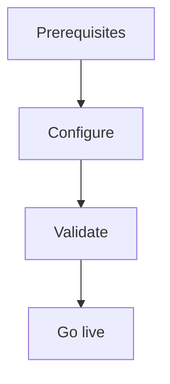

import {
  InfoBox,
  Warning,
  RelatedTopics,
  FaqAccordion,
  WorkflowCard,
} from '@site/src/components';

# Import OpenAPI

**Import OpenAPI** — Preview and apply OpenAPI into integrations/tools.

## Introduction

Follow this guide using the Admin Console at [app.qefro.com](https://app.qefro.com) and APIs on [api.qefro.com](https://api.qefro.com).

## Why it exists

Guides encode the recommended path so teams avoid insecure shortcuts.

## Concepts

See linked platform pages for definitions used in this guide.

## Architecture

Use:

1. `POST /api/v1/workspaces/:id/integrations/import/preview` (URL)
2. or `.../preview/upload` (file)
3. `POST .../import/apply`
4. Later `POST /api/v1/integrations/:id/reimport`

## Workflow

<WorkflowCard title="OpenAPI import" steps={[
  {title: 'Preview', description: 'Review operations before apply.'},
  {title: 'Apply', description: 'Create integration + tools.'},
  {title: 'Disable dangerous ops', description: 'Remove writes you do not want the AI to call.'},
  {title: 'Reimport', description: 'When upstream spec changes.'},
]} />

## Related topics

<RelatedTopics topics={[
  {label: 'Business Tools', to: '/docs/platform/business-tools'},
  {label: 'Secure Business Actions', to: '/docs/guides/secure-business-actions'},
]} />

