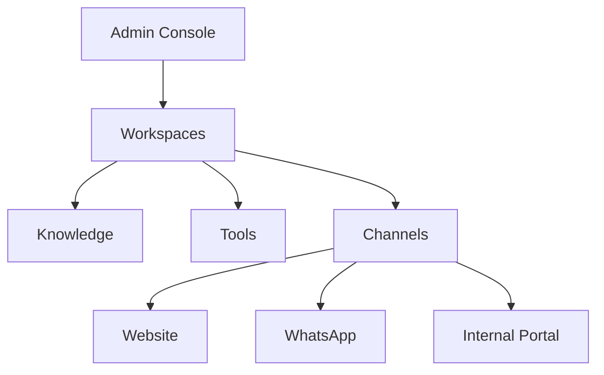

import {
  InfoBox,
  Warning,
  Success,
  RelatedTopics,
  FaqAccordion,
  WorkflowCard,
} from '@site/src/components';

# Production Deployment

This guide is the **go-live checklist** before real customers and employees rely on Qefro. Qefro cloud is already hosted — “deployment” means production readiness of *your* tenant configuration.

## Outcome

- Support and/or Employee workspaces cite-tested
- Channels bound correctly (widget / WhatsApp / portal)
- RBAC least-privilege
- Tools (if any) hardened
- Billing and monitoring understood
- Rollback / disable plan documented

## Architecture reminder

Platform: [Deployment](/docs/platform/deployment).

## Checklist

### Knowledge

- [ ] Customer vs employee corpora are in **separate** workspaces
- [ ] Top 20 questions cite correctly; unknowns refuse
- [ ] Stale docs removed or reindexed

### Customer AI

- [ ] Widget embed uses production token + Support workspace id
- [ ] Staging site tested on mobile
- [ ] WhatsApp only if Growth+ and webhook verified
- Guides: [Deploy Website Widget](/docs/guides/deploy-website-widget), [Deploy WhatsApp AI](/docs/guides/deploy-whatsapp-ai)

### Employee AI

- [ ] Members invited; Teams grant only needed workspaces
- [ ] Portal branding acceptable
- [ ] Custom domain optional but planned
- Guides: [Create Employee AI](/docs/guides/create-employee-ai), [Configure RBAC](/docs/guides/configure-rbac)

### Business Actions

- [ ] No write tools on public workspaces without review
- [ ] Secrets encrypted; rotation owner assigned
- [ ] `identify()` used when APIs need end users
- [ ] Tool logs reviewed for pilot traffic
- Guide: [Secure Business Actions](/docs/guides/secure-business-actions)

### Security & compliance

- [ ] Security Overview reviewed with stakeholders
- [ ] DPA / questionnaire completed if required
- [ ] Staging org used for experiments when possible
- Docs: [Security Overview](/docs/security/overview), [Compliance](/docs/security/compliance)

### Billing & ops

- [ ] Plan limits understood (messages, docs, WhatsApp)
- [ ] Payment method valid; webhook-driven entitlements confirmed in Billing UI
- [ ] Owner contact + support escalation path documented

## Workflow

<WorkflowCard
  title="Production gate"
  steps={[
    {title: 'Freeze corpus for pilot', description: 'Cite-test top intents.'},
    {title: 'Enable one channel', description: 'Website first.'},
    {title: 'Add staff access', description: 'RBAC for Employee AI if in scope.'},
    {title: 'Optional tools', description: 'Read-only → monitored writes.'},
    {title: 'Watch one week', description: 'Analytics, feedbacks, tool logs.'},
  ]}
/>

## Rollback

If something goes wrong:

1. Remove or comment out the website widget script.
2. Disable WhatsApp in Admin Console / Meta routing.
3. Disable Business Tools on the affected workspace.
4. Rotate tool credentials at the vendor if abuse is suspected.

<Warning>
Do not launch write-capable tools and WhatsApp on the same day as the first public widget embed. Sequence reduces blast radius.
</Warning>

## FAQ

<FaqAccordion
  items={[
    {
      question: 'Do I deploy containers myself?',
      answer:
        'Not on Qefro cloud. You configure the tenant. Enterprise private deployment is a separate conversation — see Deployment.',
    },
    {
      question: 'What is a staging strategy?',
      answer:
        'Create a separate organization for experiments, or a clearly named staging workspace that is never bound to production channels.',
    },
  ]}
/>

<Success>
When the checklist is green, announce URLs internally and monitor Admin Console analytics daily for the first week.
</Success>

## Related topics

<RelatedTopics
  topics={[
    {label: 'Build AI Customer Support', to: '/docs/guides/build-ai-customer-support'},
    {label: 'Create Employee AI', to: '/docs/guides/create-employee-ai'},
    {label: 'Secure Business Actions', to: '/docs/guides/secure-business-actions'},
    {label: 'Security Overview', to: '/docs/security/overview'},
    {label: 'Deployment', to: '/docs/platform/deployment'},
    {label: 'Release Notes', to: '/docs/release-notes'},
  ]}
/>
