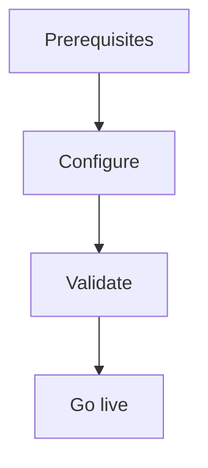

import {
  InfoBox,
  Warning,
  RelatedTopics,
  FaqAccordion,
  WorkflowCard,
} from '@site/src/components';

# Production Deployment


**Production Deployment** — Checklist before inviting real customers and employees.

## Introduction

Follow this guide using the Admin Console at [app.qefro.com](https://app.qefro.com) and APIs on [api.qefro.com](https://api.qefro.com).

## Why it exists

Guides encode the recommended path so teams avoid insecure shortcuts.

## Concepts

See linked platform pages for definitions used in this guide.

## Architecture




## Workflow

<WorkflowCard title="Go-live checklist" steps={[
  {title: 'Knowledge QA', description: 'Citations + refusals.'},
  {title: 'Channels', description: 'Widget / WhatsApp / portal.'},
  {title: 'Tools', description: 'Least privilege + logs.'},
  {title: 'RBAC', description: 'Members scoped.'},
  {title: 'Billing + webhooks', description: 'Razorpay webhook includes payment.failed.'},
  {title: 'Incident basics', description: 'Who can rotate widget token / revoke sessions.'},
]} />

```bash
curl -sS https://api.qefro.com/health
curl -sS https://api.qefro.com/ready
```

## Related topics

<RelatedTopics topics={[
  {label: 'Deployment', to: '/docs/platform/deployment'},
  {label: 'Webhooks', to: '/docs/api/webhooks'},
  {label: 'Security Overview', to: '/docs/security/overview'},
]} />


