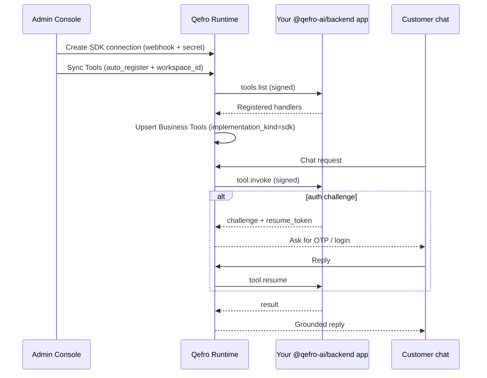

import {
  InfoBox,
  Warning,
  RelatedTopics,
  FaqAccordion,
  WorkflowCard,
  ApiEndpointCard,
} from '@site/src/components';

# Register SDK Business Tools

This guide registers **Business Tools** from your backend using the Qefro Backend Framework (`@qefro-ai/backend` or `qefro-backend-sdk`). Tools live in your code; Admin Console only manages the signed connection and syncs metadata into a workspace.

Prefer this path when tools need **customer authentication**, stateful workflows, or logic that does not map cleanly to a single REST call. For existing HTTPS APIs, use [Connect REST APIs](/docs/guides/connect-rest-apis) or [Import OpenAPI](/docs/guides/import-openapi).

## Outcome

- A public HTTPS webhook (for example `POST /qefro`) signed with a shared secret
- One or more tools registered with `app.tool(...)`
- An **SDK Connection** in Admin Console (Test + Sync Tools)
- Synced tools available as Business Tools in a workspace (`implementation_kind = sdk`)

## Prerequisites

- Owner/Admin access in Admin Console
- Node.js 18+ (TypeScript) **or** Rust for `qefro-backend-sdk`
- A publicly reachable HTTPS URL Qefro can call (SSRF-checked — no private IPs)
- Decision: which **workspace** should receive synced tools

## Concepts

| Term | Meaning |
| --- | --- |
| SDK Connection | Org-level webhook + signing secret in Admin Console |
| Handler / tool | Function registered with `app.tool({ name, ... }, handler)` |
| Sync Tools | Runtime calls `tools.list`, then optionally auto-registers Business Tools |
| Challenge / resume | Your `customer.authorize` returns a challenge; Qefro forwards the customer reply via `tool.resume` |

Qefro is an **orchestration runtime**, not an identity provider. It never sends or verifies OTP. Authentication lives in your Customer Provider and tool handlers. See [Customer Provider](/docs/v1/customer-provider) and [SDK Framework](/docs/v1/sdk-framework).

## Architecture



## Step 1 — Install the framework

### TypeScript

```bash
npm install @qefro-ai/backend
```

### Rust

```bash
cargo add qefro-backend-sdk
```

Set a strong signing secret (store in a secrets manager; never commit):

```bash
export QEFRO_SIGNING_SECRET="qefro_sdk_..."
```

## Step 2 — Register tools in code

Tools are declared in your backend. Metadata from `app.tool(...)` is what Sync Tools imports.

```ts
import { Qefro } from '@qefro-ai/backend';

const app = new Qefro({
  signingSecret: process.env.QEFRO_SIGNING_SECRET!,
});

app.customer({
  async lookup(ctx) {
    // Resolve customer from channel identity (phone, email, customer_id, …)
    return customerService.findByPhone(String(ctx.identity.phone ?? ''));
  },
  async authorize(ctx) {
    const customer = ctx.customer as {
      id: string;
      email: string;
      session?: { isValid(): boolean };
      accessToken?: string;
    };

    if (customer.session?.isValid() && customer.accessToken) {
      return {
        kind: 'success',
        customer,
        auth: {
          type: 'bearer_token',
          access_token: customer.accessToken,
          expires_in: 900,
        },
      };
    }

    if (!ctx.response) {
      await otpService.sendEmailOtp(customer.email);
      return {
        kind: 'challenge',
        challenge: {
          type: 'email_otp',
          message: 'Enter the OTP sent to your email.',
          destination_hint: customer.email,
        },
      };
    }

    const verified = await otpService.verifyEmailOtp(customer.email, ctx.response);
    if (!verified) return { kind: 'denied' };

    const token = await authService.issueToken(customer.id);
    return {
      kind: 'success',
      customer,
      auth: {
        type: 'bearer_token',
        access_token: token.access_token,
        refresh_token: token.refresh_token,
        expires_in: token.expires_in,
      },
    };
  },
});

// Public / no customer auth required
app.tool(
  {
    name: 'store_hours_get',
    description: 'Return store opening hours for a location code.',
    auth: 'none',
    input_schema: {
      type: 'object',
      properties: {
        location_code: { type: 'string' },
      },
      required: ['location_code'],
    },
  },
  async (ctx) => {
    return hoursService.get(String(ctx.parameters.location_code));
  },
);

// Requires customer authorization (challenge/resume if needed)
app.tool(
  {
    name: 'download_invoice',
    description: 'Download an invoice for the authenticated customer.',
    auth: 'required',
    permissions: ['invoice.read'],
    timeout: 30,
    authentication_methods: ['email_otp'],
    input_schema: {
      type: 'object',
      properties: {
        invoice_id: { type: 'string' },
      },
      required: ['invoice_id'],
    },
  },
  async (ctx) => {
    const customer = ctx.customer.require<{ id: string }>();
    return invoiceService.download(customer.id, String(ctx.parameters.invoice_id));
  },
);

await app.listen({ port: 8088, path: '/qefro' });
```

### Tool metadata that Sync imports

| Field | Purpose |
| --- | --- |
| `name` | Stable handler id (also `sdk_handler_name` in Qefro) |
| `description` | Shown to the LLM |
| `input_schema` | JSON Schema for parameters |
| `auth` | `none` \| `optional` \| `required` |
| `authentication_methods` | Declared methods (for example `email_otp`); non-empty → Sync sets `organization_challenge` |
| `permissions` / `timeout` | Enforced in your SDK; also useful documentation |

<InfoBox>
You do not implement routing for protocol messages yourself. `app.listen()` owns `ping`, `tools.list`, `tool.invoke`, and `tool.resume` on the configured path.
</InfoBox>

## Step 3 — Expose the webhook

1. Deploy the process behind HTTPS (load balancer / reverse proxy).
2. Forward `POST /qefro` (or your chosen path) to the Node/Rust process.
3. Confirm the URL is publicly reachable (Qefro rejects private/link-local targets).

Local development tip: use a tunnel (ngrok, Cloudflare Tunnel, etc.) so Admin Console can Test and Sync against your laptop.

## Step 4 — Create an SDK Connection in Admin Console

1. Open **Business Tools → SDK Connections** (or Organization → SDK Connections; legacy routes redirect).
2. Click **Add Connection**.
3. Set:
   - **Name** — for example `Production Backend`
   - **Webhook URL** — `https://api.company.com/qefro`
   - **Signing secret** — paste the same value as `QEFRO_SIGNING_SECRET`, or leave blank to auto-generate and copy it into your env
4. Save. If Qefro generated a secret, copy it immediately — it is shown once.

### Management APIs (Owner/Admin JWT)

<ApiEndpointCard
  method="POST"
  path="/api/v1/org/sdk-connections"
  description="Create an SDK connection (webhook_url, optional signing_secret). Returns plaintext secret once when generated."
/>

<ApiEndpointCard
  method="POST"
  path="/api/v1/org/sdk-connections/:id/test"
  description="Send signed ping; updates connection status / last_seen / last_error."
/>

<ApiEndpointCard
  method="POST"
  path="/api/v1/org/sdk-connections/:id/sync-tools"
  description="Call tools.list. With auto_register=true and workspace_id, upsert Business Tools in that workspace."
/>

```bash
# Create connection
curl -sS -X POST \
  -H "Authorization: Bearer $USER_JWT" \
  -H "Content-Type: application/json" \
  https://api.qefro.com/api/v1/org/sdk-connections \
  -d '{
    "name": "Production Backend",
    "webhook_url": "https://api.company.com/qefro",
    "enabled": true
  }'

# Test (ping)
curl -sS -X POST \
  -H "Authorization: Bearer $USER_JWT" \
  https://api.qefro.com/api/v1/org/sdk-connections/$CONNECTION_ID/test

# Sync + auto-register into a workspace
curl -sS -X POST \
  -H "Authorization: Bearer $USER_JWT" \
  -H "Content-Type: application/json" \
  https://api.qefro.com/api/v1/org/sdk-connections/$CONNECTION_ID/sync-tools \
  -d '{
    "workspace_id": "'"$WORKSPACE_ID"'",
    "auto_register": true,
    "enable_new_tools": true
  }'
```

## Step 5 — Test Connection

Use **Test Connection** in the console (or the `…/test` API). Qefro sends a signed `ping`; a healthy app returns `pong` with protocol/SDK version. Fix signature mismatches, clock skew, TLS, or path routing before syncing.

## Step 6 — Sync Tools into a workspace

1. Select the target workspace in Business Tools.
2. Open **SDK Connections**.
3. Click **Sync Tools**.

With a workspace selected, Sync calls `tools.list` and **auto-registers** handlers as Business Tools under an integration named `SDK: {connection name}`.

What Sync writes for each handler:

| Business Tool field | Source |
| --- | --- |
| `implementation_kind` | `sdk` |
| `sdk_connection_id` | Connection id |
| `sdk_handler_name` | Tool `name` |
| `required_auth_level` | `organization_challenge` if `authentication_methods` is non-empty; else `public` |
| `input_schema` / description | From `tools.list` |

Re-run Sync after you add or rename handlers in code.

<Warning>
Sync without a workspace only refreshes the connection’s registered-tool snapshot. Select a workspace (or pass `workspace_id` + `auto_register: true`) so tools appear for chat.
</Warning>

## Step 7 — Enable and verify in chat

1. Confirm tools are **Enabled** on the Business Tools list (Type = SDK).
2. Test from Admin Console **Test Tool**, or chat on Widget / WhatsApp.
3. For `auth: 'required'` tools, exercise the challenge path (OTP / login) end to end.
4. Review execution logs on the tool after production traffic.

Channels: Widget and WhatsApp support Business Tools in V1; Internal Portal does not. See [Business Tools](/docs/platform/business-tools).

## Protocol reference (what Qefro sends)

| Message | When | Your response |
| --- | --- | --- |
| `ping` | Test Connection | `{ "type": "pong", ... }` |
| `tools.list` | Sync Tools | `{ "type": "tools.list", "tools": [...] }` |
| `tool.invoke` | Chat / Test Tool | `result`, `challenge`, or `error` |
| `tool.resume` | Customer replied to a challenge | Same as invoke outcomes |

Request signing uses HMAC over timestamp + body (`X-Qefro-Signature`, `X-Qefro-Timestamp`, `X-Qefro-Protocol: 1`). The framework verifies and signs for you when you use `app.listen()`.

## Workflow checklist

<WorkflowCard
  title="SDK Business Tools launch"
  steps={[
    {title: 'Install framework', description: '@qefro-ai/backend or qefro-backend-sdk + signing secret.'},
    {title: 'Register tools', description: 'app.tool + customer lookup/authorize.'},
    {title: 'Expose HTTPS webhook', description: 'POST /qefro publicly reachable.'},
    {title: 'Create SDK Connection', description: 'Webhook URL + secret in Admin Console.'},
    {title: 'Test + Sync', description: 'ping healthy, then sync into a workspace.'},
    {title: 'Chat verify', description: 'Enable tools; test challenge/resume for auth-required handlers.'},
  ]}
/>

## Choosing REST vs OpenAPI vs SDK

| Need | Path |
| --- | --- |
| Existing CRUD API, one endpoint | [Connect REST APIs](/docs/guides/connect-rest-apis) |
| Many operations from a spec | [Import OpenAPI](/docs/guides/import-openapi) |
| Customer OTP/login, workflows, custom logic | **This guide (SDK)** |

You can mix REST/OpenAPI and SDK tools in the same workspace.

## FAQ

<FaqAccordion
  items={[
    {
      question: 'Do I configure OTP endpoints in Admin Console?',
      answer:
        'No. Customer authentication stays in your SDK Customer Provider. Admin Console only manages the SDK connection (health, secret, sync).',
    },
    {
      question: 'Where does the signing secret live?',
      answer:
        'Encrypted on the Qefro connection, and as QEFRO_SIGNING_SECRET in your backend. Rotate from the console when needed; update your env immediately.',
    },
    {
      question: 'Why do synced SDK tools show a placeholder URL?',
      answer:
        'SDK tools are not HTTPS adapters. Execution uses the signed webhook and sdk_handler_name. The placeholder URL is internal only.',
    },
    {
      question: 'Can I register tools without auto_register?',
      answer:
        'Yes. Sync without auto_register still updates the connection snapshot. You can also create tools manually with implementation_kind=sdk and sdk_connection_id, but Sync is the recommended path.',
    },
    {
      question: 'Is there an example repo?',
      answer:
        'Yes. Clone github.com/qefro-ai/qefro-js-backend-sdk and run examples/ (basic-sdk, order-status, ecommerce, and more). Each has scripts/smoke.sh for signed ping / tools.list / tool.invoke checks.',
    },
  ]}
/>

## Related topics

<RelatedTopics
  topics={[
    {label: 'SDK Framework', to: '/docs/v1/sdk-framework'},
    {label: 'Business Tools (V1)', to: '/docs/v1/business-tools'},
    {label: 'Customer Provider', to: '/docs/v1/customer-provider'},
    {label: 'Business Tools (platform)', to: '/docs/platform/business-tools'},
    {label: 'Connect REST APIs', to: '/docs/guides/connect-rest-apis'},
    {label: 'Import OpenAPI', to: '/docs/guides/import-openapi'},
    {label: 'Secure Business Actions', to: '/docs/guides/secure-business-actions'},
    {label: 'Examples', to: '/docs/v1/examples'},
  ]}
/>
