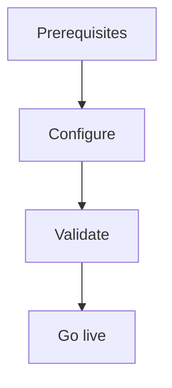

import {
  InfoBox,
  Warning,
  RelatedTopics,
  FaqAccordion,
  WorkflowCard,
} from '@site/src/components';

# Secure Business Actions

**Secure Business Actions** — Least privilege tools, encrypted secrets, identify(), SSRF, logs.

## Introduction

Follow this guide using the Admin Console at [app.qefro.com](https://app.qefro.com) and APIs on [api.qefro.com](https://api.qefro.com).

## Why it exists

Guides encode the recommended path so teams avoid insecure shortcuts.

## Concepts

See linked platform pages for definitions used in this guide.

## Architecture

## Workflow

<WorkflowCard title="Harden tools" steps={[
  {title: 'Least privilege', description: 'Read-only first.'},
  {title: 'Encrypt secrets', description: 'Never in frontend.'},
  {title: 'identify() when needed', description: 'Per-user APIs.'},
  {title: 'Review logs', description: 'GET /api/v1/tools/:id/logs.'},
  {title: 'Separate workspaces', description: 'Customer vs internal tools.'},
]} />

## Security notes

<Warning>
Outbound calls are SSRF-validated. Do not weaken DNS pinning for convenience.
</Warning>

## Related topics

<RelatedTopics topics={[
  {label: 'Business Actions', to: '/docs/platform/business-actions'},
  {label: 'Identity Forwarding', to: '/docs/platform/identity-forwarding'},
  {label: 'Security Overview', to: '/docs/security/overview'},
]} />

