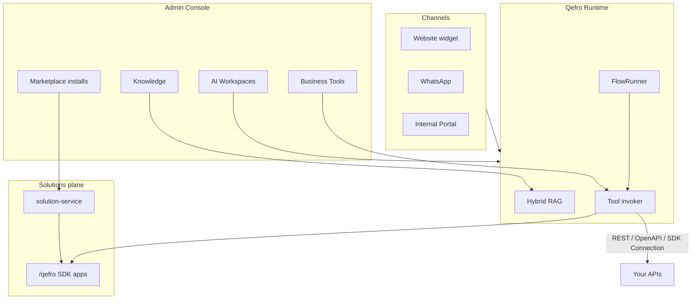

import { InfoBox, RelatedTopics } from '@site/src/components';

# Architecture

This page is a short entry point. The canonical deep dive is
**[Qefro architecture](/docs/architecture/overview)** (including the
**solutions plane**: solution-service, managed apps, Marketplace, portal
renderer, and capability registries).

<InfoBox>
**Two tool paths:** Business Tools (REST/OpenAPI or Backend SDK **webhook**) vs
installable **SDK apps** (managed `/qefro`). See [Core concepts](/docs/introduction/concepts).
</InfoBox>

## Related topics

<RelatedTopics
  topics={[
    {label: 'Full architecture overview', to: '/docs/architecture/overview'},
    {label: 'Solutions architecture', to: '/docs/solutions/architecture'},
    {label: 'vs n8n', to: '/docs/compare/n8n-vs-qefro'},
    {label: 'vs LangGraph', to: '/docs/compare/langgraph-vs-qefro'},
    {label: 'Core concepts', to: '/docs/introduction/concepts'},
  ]}
/>
