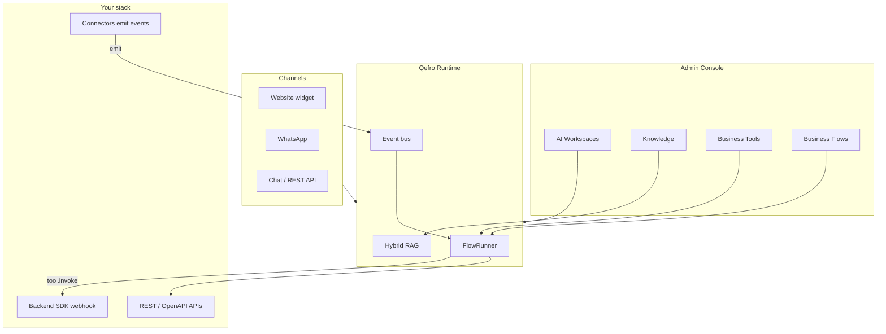

import { InfoBox, RelatedTopics } from '@site/src/components';

# Architecture

Qefro separates **configuration** (Admin Console), **execution** (Runtime / FlowRunner), **channels** (widget, WhatsApp, API), and **your systems** (Backend SDK + connectors).

## Core principles

1. **Single runtime** — Conversation intent, events, webhooks, and schedules all start Business Flows in **FlowRunner**. There is no second orchestrator inside connectors.
2. **Workspace isolation** — Knowledge, tools, and conversations are scoped to an AI Workspace inside an organization (tenant).
3. **Tools live with you** — REST/OpenAPI credentials are encrypted in Qefro; Backend SDK handlers run in **your** backend over a signed webhook.
4. **Events are triggers only** — Connectors `emit()` namespaced envelopes; the bus validates, queues, and dispatches. See [Events](/docs/developer/concepts/events).

## Multi-tenant model

Organization → Teams / RBAC → AI Workspaces → Channels bound to workspaces.

Deep dive: [Multi-tenant AI Architecture](/docs/concepts/multi-tenant-ai-architecture).

## Related topics

<RelatedTopics
  topics={[
    {label: 'Overview', to: '/docs/introduction/overview'},
    {label: 'Runtime', to: '/docs/developer/concepts/runtime'},
    {label: 'Events', to: '/docs/developer/concepts/events'},
    {label: 'Deployment', to: '/docs/platform/deployment'},
  ]}
/>
