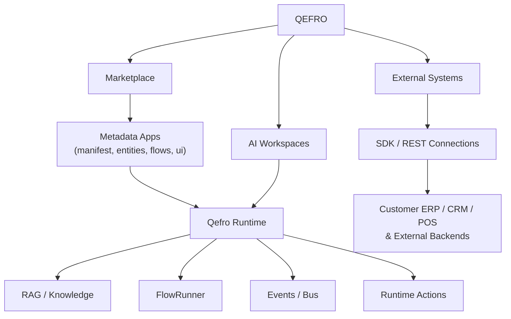

import { InfoBox, RelatedTopics } from '@site/src/components';

# Architecture

Qefro unifies AI Workspaces, declarative Marketplace Apps, and external systems into a single multi-tenant execution platform.


```mermaid
flowchart TD
  QEFRO["QEFRO"] --> WS["AI Workspaces"]
  QEFRO --> MKT["Marketplace"]
  QEFRO --> EXT["External Systems"]

  MKT --> META["Metadata Apps\n(manifest, entities, flows, ui)"]
  META --> RT["Qefro Runtime"]
  WS --> RT

  RT --> RAG["RAG / Knowledge"]
  RT --> FR["FlowRunner"]
  RT --> EVT["Events / Bus"]
  RT --> ACT["Runtime Actions"]

  EXT --> CONN["SDK / REST Connections"]
  CONN --> EXT_SYS["Customer ERP / CRM / POS\n& External Backends"]
```

## Two Fundamentally Distinct Application & Integration Models

The platform cleanly separates domain application development from external system integration:

### A. Metadata Marketplace App

```text
Metadata (YAML) ──▶ Marketplace Registry ──▶ Workspace Install ──▶ Qefro Runtime
```

- **Definition:** Pure declarative metadata (`manifest.yaml`, `entities/`, `workflows/`, `ui/`, `events/`, `capabilities/`).
- **Execution:** Interpreted directly by **Qefro Runtime**.
- **Application Server:** **None required.** No Docker containers, no SDK backends, no `/qefro` processes.
- **Storage:** Managed by Qefro runtime storage with strict tenant/workspace/installation isolation.
- **Use Case:** Domain applications that Qefro owns (e.g. hospitality, clinics, real estate, appointment booking, commerce).

### B. External System Integration

```text
Qefro FlowRunner / Action Engine ──▶ REST / OpenAPI / SDK Connection ──▶ Customer ERP / POS / CRM
```

- **Definition:** External HTTP API or signed webhook connection via the Qefro Backend SDK.
- **Execution:** Runs in the customer's or third-party infrastructure.
- **Application Server:** Maintained by the customer / external provider.
- **Storage:** Persisted in the external system of record (e.g., Focus ERP, ERPNext, Odoo, SAP, custom DB).
- **Use Case:** Existing systems of record where Qefro serves as the AI and execution layer.

<InfoBox>
<strong>Architectural Rule:</strong> Marketplace Apps and External Integrations are not two hosting variants of the same application model. Marketplace Apps are declarative metadata packages executed natively by Qefro Runtime. External Integrations are connections to external software systems.
</InfoBox>

## Architectural Deep Dive

For the complete technical breakdown including FlowRunner state machines, runtime action authority, storage schemas, and trust boundaries:

- **[Full Platform Architecture Overview](/docs/architecture/overview)**
- **[Qefro Runtime Execution Architecture](/docs/developer/concepts/runtime)**
- **[Marketplace Architecture & Development](/docs/solutions/architecture)**
- **[Integration Decision Guide](/docs/developer/integration-models)**

## Related topics

<RelatedTopics
  topics={[
    {label: 'Full architecture overview', to: '/docs/architecture/overview'},
    {label: 'Runtime concept', to: '/docs/developer/concepts/runtime'},
    {label: 'Marketplace architecture', to: '/docs/solutions/architecture'},
    {label: 'Integration models', to: '/docs/developer/integration-models'},
    {label: 'vs n8n', to: '/docs/compare/n8n-vs-qefro'},
    {label: 'vs LangGraph', to: '/docs/compare/langgraph-vs-qefro'},
  ]}
/>
