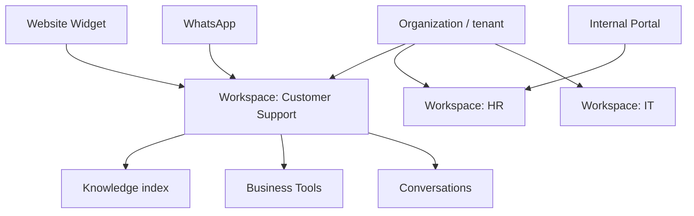

import {
  InfoBox,
  Warning,
  RelatedTopics,
  FaqAccordion,
  WorkflowCard,
  ArchitectureCard,
  FeatureCardGrid,
} from '@site/src/components';
import Tabs from '@theme/Tabs';
import TabItem from '@theme/TabItem';

# AI Workspaces

An **AI Workspace** is a scoped AI environment inside a Qefro **organization (tenant)**. Each workspace has its own knowledge base, assistant instructions, Business Tools, and conversations. Customer AI (website widget, WhatsApp) and Employee AI (Internal Portal) bind to workspaces you configure in the Admin Console.

## Introduction

In the product data model:

- **Organization / tenant** — top-level isolation and billing boundary (`app.qefro.com` signup)
- **Workspace** — team/use-case boundary (Customer Support, HR, IT, …)
- **Team (org RBAC)** — grants Members access to specific workspaces

Admin Console APIs expose workspaces under `/api/v1/org/workspaces` (list/get) and GraphQL for day-to-day console operations.

## Why it exists

Mixing customer FAQs with internal HR policy causes inaccurate answers and privacy risk. Workspaces make isolation the default: retrieval and Business Actions stay inside the selected workspace.

## Concepts

| Term | Meaning in Qefro |
| --- | --- |
| Organization | Tenant: users, billing, branding, widget token |
| Workspace | Isolated knowledge + tools + conversations |
| Instructions | System guidance (tone, language, refusal) |
| Business Tools | REST/OpenAPI connectors bound to a workspace |
| Experience | Widget, Internal Portal, or WhatsApp → workspace |

## Architecture



<FeatureCardGrid>
  <ArchitectureCard layer="Tenant" title="Organization" description="Billing, members, branding, publishable widget token." />
  <ArchitectureCard layer="Scope" title="Workspace" description="Knowledge and tools never cross unless you design it." />
  <ArchitectureCard layer="Access" title="Teams + RBAC" description="Owner/Admin/Member; Members only see granted workspaces." />
</FeatureCardGrid>

## Workflow

<WorkflowCard
  title="Operate a workspace"
  steps={[
    {title: 'Create', description: 'Admin Console → create workspace and name the use case.'},
    {title: 'Ingest knowledge', description: 'Upload documents or crawl approved sites (POST /api/v1/documents).'},
    {title: 'Attach tools', description: 'Under the workspace, create integrations/tools or import OpenAPI.'},
    {title: 'Bind channels', description: 'Widget data-workspace-id, portal workspace access, WhatsApp mapping.'},
    {title: 'Monitor', description: 'Analytics, feedbacks, and tool execution logs.'},
  ]}
/>

## Code examples

<Tabs>
  <TabItem value="html" label="Widget bind" default>

```html
<script
  src="https://cdn.qefro.com/widget.js"
  data-token="YOUR_WIDGET_TOKEN"
  data-endpoint="https://api.qefro.com"
  data-workspace-id="YOUR_WORKSPACE_ID">
</script>
```

  </TabItem>
  <TabItem value="curl" label="Org workspaces API">

```bash
curl -sS \
  -H "Authorization: Bearer $USER_JWT" \
  https://api.qefro.com/api/v1/org/workspaces
```

  </TabItem>
</Tabs>

## Best practices

- One primary audience per workspace (customers vs employees)
- Start narrow on knowledge quality before bulk imports
- Cross-test: ask Support questions against HR knowledge to prove isolation
- Assign a human owner per workspace

## Security notes

<Warning>
Do not attach privileged write Business Tools to a public Customer AI workspace without identity forwarding (`identify()`) and least-privilege scopes.
</Warning>

## FAQ

<FaqAccordion
  items={[
    {
      question: 'What is an AI Workspace?',
      answer:
        'A scoped AI environment with its own knowledge, instructions, Business Tools, and conversations inside a Qefro organization.',
    },
    {
      question: 'How do Members get access?',
      answer:
        'Via Organization → Teams: add users to a team, then attach workspaces to that team. Owners/Admins can access all workspaces.',
    },
  ]}
/>

## Related topics

<RelatedTopics
  topics={[
    {label: 'Knowledge Platform', to: '/docs/platform/knowledge-platform'},
    {label: 'Business Actions', to: '/docs/platform/business-actions'},
    {label: 'Business Tools', to: '/docs/platform/business-tools'},
    {label: 'RBAC', to: '/docs/platform/rbac'},
    {label: 'Customer AI', to: '/docs/platform/customer-ai'},
    {label: 'Employee AI', to: '/docs/platform/employee-ai'},
    {label: 'Analytics', to: '/docs/platform/analytics'},
  ]}
/>
