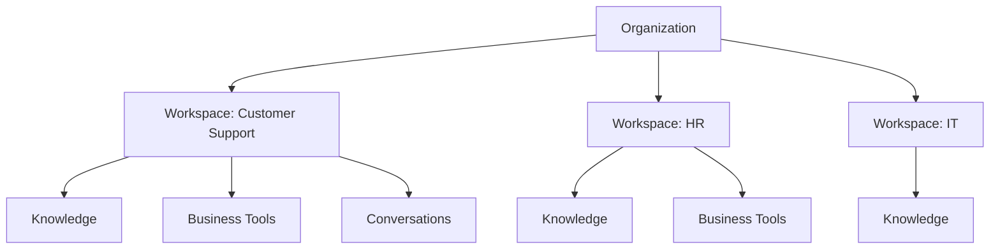

import {
  InfoBox,
  Warning,
  RelatedTopics,
  FaqAccordion,
  WorkflowCard,
  ArchitectureCard,
  FeatureCardGrid,
} from '@site/src/components';
import Tabs from '@theme/Tabs';
import TabItem from '@theme/TabItem';

# AI Workspaces

An **AI Workspace** is a scoped AI environment for a team or use case inside a Qefro organization. Every workspace has its own knowledge base, instructions, Business Tools, conversations, and permission boundaries.

## Introduction

Qefro is organized around workspaces — for example Customer Support, HR, or IT. Configure once in the Admin Console, then deploy Customer AI and Employee AI experiences that read from the correct workspace.

## Why it exists

Organizations rarely have one corpus and one audience. Mixing customer FAQs with internal HR policy creates inaccurate answers and privacy risk. Workspaces make isolation the default.

## Concepts

| Concept | Meaning |
| --- | --- |
| Organization | Tenant that owns users, billing, and workspaces |
| Workspace | Isolated knowledge + tools + conversations |
| Instructions | System guidance (tone, language, refusal) |
| Business Tools | Connectors available to actions in the workspace |
| Experience | Widget, Internal Portal, or WhatsApp bound to a workspace |

## Architecture



<FeatureCardGrid>
  <ArchitectureCard layer="Boundary" title="Tenant" description="Organization-level isolation for users and billing." />
  <ArchitectureCard layer="Boundary" title="Workspace" description="Knowledge and tools never cross unless you explicitly design it." />
  <ArchitectureCard layer="Runtime" title="Experiences" description="Widget, portal, and WhatsApp select a workspace at runtime." />
</FeatureCardGrid>

## Workflow

<WorkflowCard
  title="Create and operate a workspace"
  steps={[
    {title: 'Create', description: 'Name the workspace and assign owners.'},
    {title: 'Ingest knowledge', description: 'Upload docs or crawl approved sites.'},
    {title: 'Attach tools', description: 'Bind least-privilege Business Tools.'},
    {title: 'Connect channels', description: 'Widget, portal, and/or WhatsApp.'},
    {title: 'Monitor', description: 'Review analytics, refusals, and action logs.'},
  ]}
/>

## Code examples

<Tabs>
  <TabItem value="json" label="JSON" default>

```json
{
  "organization_id": "org_...",
  "workspace": {
    "name": "Customer Support",
    "instructions": "Answer only from knowledge. Cite sources. Refuse when unsure.",
    "channels": ["website_widget", "whatsapp"]
  }
}
```

  </TabItem>
  <TabItem value="ts" label="TypeScript">

```typescript
type Workspace = {
  id: string;
  name: string;
  instructions: string;
  knowledgeIsolated: true;
};
```

  </TabItem>
  <TabItem value="curl" label="cURL">

```bash
curl -sS -H "Authorization: Bearer $QEFRO_TOKEN" \
  https://api.qefro.com/api/v1/workspaces
```

  </TabItem>
</Tabs>

## Best practices

- One primary audience per workspace (customers vs employees)
- Start narrow: high-quality docs before bulk imports
- Test cross-topic questions to prove isolation
- Document a human owner for each workspace

## Security notes

<Warning>
Do not attach privileged Business Tools to a public Customer AI workspace without identity forwarding and strict allowlists.
</Warning>

<InfoBox>
Workspace isolation is complementary to tenant isolation. Both must hold under test.
</InfoBox>

## FAQ

<FaqAccordion
  items={[
    {
      question: 'What is an AI Workspace?',
      answer:
        'A scoped AI environment with its own knowledge, instructions, tools, and conversations inside a Qefro organization.',
    },
    {
      question: 'Can two workspaces share the same documents?',
      answer:
        'Upload or connect sources per workspace. Sharing should be intentional — do not rely on accidental overlap.',
    },
    {
      question: 'How do workspaces relate to teams?',
      answer:
        'Teams and RBAC control who can configure or use a workspace. See Teams and RBAC docs.',
    },
  ]}
/>

## Related topics

<RelatedTopics
  topics={[
    {label: 'Knowledge Platform', to: '/docs/platform/knowledge-platform'},
    {label: 'Business Actions', to: '/docs/platform/business-actions'},
    {label: 'RBAC', to: '/docs/platform/rbac'},
    {label: 'Internal Portal', to: '/docs/platform/internal-portal'},
    {label: 'Analytics', to: '/docs/platform/analytics'},
    {label: 'Customer AI', to: '/docs/platform/customer-ai'},
    {label: 'Employee AI', to: '/docs/platform/employee-ai'},
  ]}
/>
