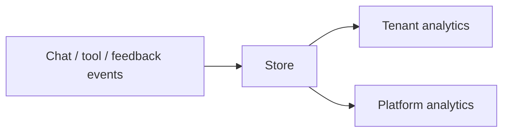

import {
  InfoBox,
  Warning,
  RelatedTopics,
  FaqAccordion,
  WorkflowCard,
  ApiEndpointCard,
} from '@site/src/components';

# Analytics


**Analytics** summarizes usage for a tenant — conversations, messages, and related signals exposed via `GET /api/v1/tenant/analytics` and feedbacks via `GET /api/v1/tenant/feedbacks`. Platform operators have additional `/api/v1/admin/analytics/*` and LLM usage endpoints.

## Introduction

Use analytics after launch to spot deflection, low-citation answers, and handoff volume.

## Why it exists

Without metrics, teams cannot tell if knowledge gaps or tool failures are driving escalations.

## Concepts

- Tenant analytics dashboard
- Message feedback
- Platform usage (super admin)

## Architecture



## Workflow

<WorkflowCard title="Weekly review" steps={[
  {title: 'Open analytics', description: 'Admin Console analytics views.'},
  {title: 'Sample failures', description: 'Read conversations with poor feedback.'},
  {title: 'Fix knowledge/tools', description: 'Reindex or tighten tool scopes.'},
]} />

## Code examples

```bash
curl -sS -H "Authorization: Bearer $USER_JWT" \
  https://api.qefro.com/api/v1/tenant/analytics
```

## Best practices

- Pair analytics with citation spot-checks
- Track tool error rates via tool logs

## Security notes

<InfoBox>
Analytics endpoints require authenticated tenant membership — not the public widget token.
</InfoBox>

## FAQ

<FaqAccordion items={[
  {question: 'Are analytics real-time?', answer: 'Near real-time depending on traffic; refresh the console after test chats.'},
]} />

## Related topics

<RelatedTopics topics={[
  {label: 'AI Workspaces', to: '/docs/platform/ai-workspaces'},
  {label: 'Customer AI', to: '/docs/platform/customer-ai'},
]} />


