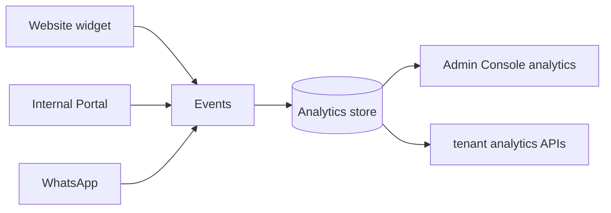

import {
  InfoBox,
  RelatedTopics,
  FaqAccordion,
  WorkflowCard,
  ApiEndpointCard,
} from '@site/src/components';

# Analytics

**Analytics** in Qefro shows how Customer AI and Employee AI are used in your organization — conversations, messages, feedback, and related signals — so you can improve knowledge and tools with evidence.

## Short definition (citation-ready)

> Tenant analytics aggregates conversation and feedback signals for an organization; platform operators have separate admin analytics for fleet-wide usage.

## What you can see

| Signal | Why it matters |
| --- | --- |
| Conversation / message volume | Capacity and channel adoption |
| Feedback scores | Answer quality perception |
| Tool errors (via tool logs) | Broken Business Actions |
| Low-citation chats (spot check) | Knowledge gaps |

Admin Console exposes tenant views. APIs:

<ApiEndpointCard
  method="GET"
  path="/api/v1/tenant/analytics"
  description="Tenant-scoped usage analytics for the authenticated organization."
/>

<ApiEndpointCard
  method="GET"
  path="/api/v1/tenant/feedbacks"
  description="User feedback entries tied to conversations."
/>

Platform Super Admin surfaces also exist under `/api/v1/admin/analytics/*` (not for tenant Admins).

## Architecture

## Weekly review workflow

<WorkflowCard
  title="Weekly quality loop"
  steps={[
    {title: 'Open analytics', description: 'Compare channels and workspaces.'},
    {title: 'Sample poor feedback', description: 'Read 5–10 conversations.'},
    {title: 'Classify root cause', description: 'Missing doc vs wrong workspace vs tool error.'},
    {title: 'Fix', description: 'Reingest, split workspaces, or repair tools.'},
    {title: 'Retest', description: 'Ask the same questions again.'},
  ]}
/>

## Best practices

- Pair dashboards with manual citation spot-checks
- Track tool error rates in [Audit Logs](/docs/security/audit-logs) / tool logs
- Do not chase vanity message counts without quality review
- Keep Support and HR analytics interpreted separately (different workspaces)

## Security notes

<InfoBox>
Analytics APIs require an authenticated org user JWT — not the publishable widget token.
</InfoBox>

## FAQ

<FaqAccordion
  items={[
    {
      question: 'Are analytics real-time?',
      answer:
        'Near real-time depending on traffic. Refresh after test chats before drawing conclusions.',
    },
    {
      question: 'Can Members see analytics?',
      answer:
        'Analytics are intended for Owners/Admins operating the tenant. Members use the Internal Portal for chat.',
    },
  ]}
/>

## Related topics

<RelatedTopics
  topics={[
    {label: 'AI Workspaces', to: '/docs/platform/ai-workspaces'},
    {label: 'Customer AI', to: '/docs/platform/customer-ai'},
    {label: 'Employee AI', to: '/docs/platform/employee-ai'},
    {label: 'Production Deployment', to: '/docs/guides/production-deployment'},
    {label: 'Audit Logs', to: '/docs/security/audit-logs'},
  ]}
/>
