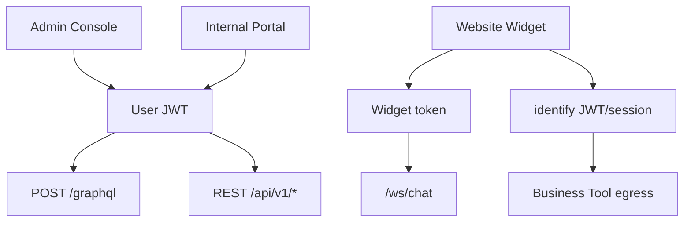

import {
  InfoBox,
  Warning,
  RelatedTopics,
  FaqAccordion,
  WorkflowCard,
} from '@site/src/components';

# Authentication

**Authentication** in Qefro depends on the surface:

| Surface | Mechanism |
| --- | --- |
| Admin Console / Internal Portal users | Email+password (OTP verify on signup), session JWT |
| Website Widget | Publishable **widget token** (`Authorization: Bearer` / `?token=`) |
| End-user identity for tools | Host JWT/session via `identify()` headers |
| Super Admin | Separate `/api/v1/admin/auth/login` |
| GraphQL | Same user JWT on `POST /graphql` |
| Metrics | Optional `METRICS_AUTH_TOKEN` bearer when not public |

## Introduction

User auth routes live under the API (REST + GraphQL). Abuse controls rate-limit login/OTP/forgot/reset (e.g. login ~20 / 15 min per email). Sessions can be listed and revoked (`/api/v1/me/sessions`, org admin session revoke).

## Why it exists

Customer AI, Employee AI, and Admin Console have different trust levels. Mixing them would either over-expose tools or block legitimate embeds.

## Concepts

- **User JWT** — org member session for console/portal/REST
- **Widget token** — site embed key; rotatable
- **End-user token** — your customer’s JWT/session for Business Tools
- **Super Admin** — platform operator, not tenant Owner

## Architecture



## Workflow

<WorkflowCard
  title="Secure a production tenant"
  steps={[
    {title: 'Owner account', description: 'Strong password; verify email.'},
    {title: 'Invite Admins', description: 'Prefer Admin over sharing Owner login.'},
    {title: 'Rotate widget token if leaked', description: 'Update every embed.'},
    {title: 'Revoke sessions on offboarding', description: 'me/sessions or org member sessions.'},
  ]}
/>

## Code examples

```bash
# Health is public
curl -sS https://api.qefro.com/health

# Authenticated REST example
curl -sS -H "Authorization: Bearer $USER_JWT" \
  https://api.qefro.com/api/v1/org/roles
```

## Best practices

- Never put User JWTs in the website widget snippet
- Use `identify()` only for customer end users, not to impersonate org Admins
- Review org audit logs after role changes

## Security notes

<Warning>
Super Admin credentials are platform-level. Tenant Owners cannot perform super-admin actions; Admins cannot transfer ownership or delete the Owner.
</Warning>

## FAQ

<FaqAccordion
  items={[
    {
      question: 'Is SSO/SAML available?',
      answer: 'SSO/SAML is on the Enterprise roadmap — contact Sales for timeline.',
    },
  ]}
/>

## Related topics

<RelatedTopics
  topics={[
    {label: 'RBAC', to: '/docs/platform/rbac'},
    {label: 'Identity Forwarding', to: '/docs/platform/identity-forwarding'},
    {label: 'API Authentication', to: '/docs/api/authentication'},
    {label: 'Security Overview', to: '/docs/security/overview'},
  ]}
/>
