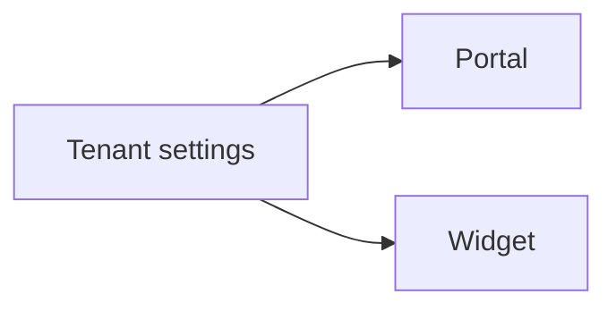

import {
  InfoBox,
  Warning,
  RelatedTopics,
  FaqAccordion,
  WorkflowCard,
  ApiEndpointCard,
} from '@site/src/components';

# Branding


**Branding** customizes the Internal Portal and widget chrome (primary color, theme, welcome message). Public bootstrap uses `GET /api/v1/public/tenant-branding`.

## Introduction

Configure in Admin Console → Settings (Employee branding / Widget appearance). Widget embeds also accept `data-primary-color`, `data-theme`, and `data-welcome-message`.

## Why it exists

Employees and customers should recognize your brand, not a generic chat bubble.

## Concepts

- Tenant branding payload
- Widget appearance overrides
- Portal share link

## Architecture



## Workflow

<WorkflowCard title="Apply branding" steps={[
  {title: 'Upload logo', description: 'Employee branding section.'},
  {title: 'Set colors', description: 'Match brand guidelines.'},
  {title: 'Preview', description: 'Portal + Widget live preview.'},
]} />

## Code examples

```bash
curl -sS "https://api.qefro.com/api/v1/public/tenant-branding?slug=acme"
```

## Best practices

- Keep contrast accessible in light and dark themes
- Align widget primary color with website CTAs

## Security notes

<InfoBox>
Only allow HTTPS logo URLs from trusted origins.
</InfoBox>

## FAQ

<FaqAccordion items={[
  {question: 'Does branding change model behavior?', answer: 'No — instructions and knowledge do. Branding is presentation.'},
]} />

## Related topics

<RelatedTopics topics={[
  {label: 'Internal Portal', to: '/docs/platform/internal-portal'},
  {label: 'Website Widget', to: '/docs/platform/website-widget'},
  {label: 'Custom Domains', to: '/docs/platform/custom-domains'},
]} />


