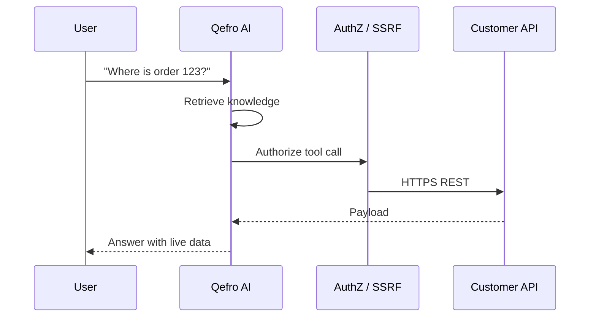

import {
  InfoBox,
  Warning,
  RelatedTopics,
  FaqAccordion,
  WorkflowCard,
} from '@site/src/components';

# Business Actions

A **Business Action** is the runtime execution of a **Business Tool** during a conversation — for example looking up an order or creating a ticket in your system of record.

## Introduction

Flow in production:

1. User message arrives (Website Widget or WhatsApp; Internal Portal is knowledge-only in V1)
2. Assistant retrieves workspace knowledge (hybrid RAG)
3. When appropriate, the model selects an allowed tool in that workspace (customer channels only)
4. Qefro authorizes the call, performs SSRF-safe HTTPS egress, and records an execution log
5. Result is folded into the assistant reply

### Channel support (V1)

| Channel | Business Tool execution |
| --- | --- |
| Website Widget | ✓ Supported |
| WhatsApp | ✓ Supported |
| Internal Portal | ✗ Not supported |

Internal Portal requests that would require a Business Tool receive a structured `BUSINESS_TOOLS_NOT_SUPPORTED` response. Knowledge search and RAG continue to work normally.

Future Portal support may use enterprise SSO, OAuth On-Behalf-Of, identity federation, employee identity delegation, and JWT forwarding — without removing the existing channel gate.

## Why it exists

Answers without actions force users to leave chat and dig through portals. Actions without isolation are unsafe. Qefro combines both under workspace + RBAC boundaries.

## Concepts

- **Tool selection** — only tools attached to the active workspace
- **Identity** — optional end-user forwarding via `identify()` on the widget
- **Execution log** — `GET /api/v1/tools/:id/logs`
- **Failure modes** — tool errors surface safely; they must not leak secrets

## Architecture



## Workflow

<WorkflowCard
  title="Ship a safe action"
  steps={[
    {title: 'Define tool', description: 'REST or OpenAPI import in the workspace.'},
    {title: 'Least privilege', description: 'Read-only scopes first; encrypt secrets.'},
    {title: 'Identity (if needed)', description: 'Widget identify() for per-user APIs.'},
    {title: 'Test', description: 'Console tool test + conversational trial.'},
    {title: 'Audit', description: 'Watch execution logs in production.'},
  ]}
/>

## Code examples

```bash
# Inspect recent executions
curl -sS -H "Authorization: Bearer $USER_JWT" \
  https://api.qefro.com/api/v1/tools/$TOOL_ID/logs
```

## Best practices

- Separate “customer-safe” tools from “admin-only” tools via workspaces
- Prefer idempotent reads for auto-invoked actions
- Document expected side effects for write tools

## Security notes

<Warning>
Treat every new tool like a production integration: SSRF validation, encrypted secrets, and review after OpenAPI reimport.
</Warning>

## FAQ

<FaqAccordion
  items={[
    {
      question: 'Does Qefro store my CRM data?',
      answer:
        'Tool responses may appear in conversation transcripts. Your CRM remains the system of record. Review retention and access with your security team.',
    },
  ]}
/>

## Related topics

<RelatedTopics
  topics={[
    {label: 'What are Business Actions?', to: '/docs/concepts/business-actions'},
    {label: 'Business Tools', to: '/docs/platform/business-tools'},
    {label: 'Connect REST APIs', to: '/docs/guides/connect-rest-apis'},
    {label: 'Import OpenAPI', to: '/docs/guides/import-openapi'},
    {label: 'Identity Forwarding', to: '/docs/platform/identity-forwarding'},
    {label: 'Website Widget', to: '/docs/platform/website-widget'},
    {label: 'WhatsApp', to: '/docs/platform/whatsapp'},
    {label: 'AI Agent Security', to: '/docs/concepts/ai-agent-security'},
    {label: 'Secure Business Actions', to: '/docs/guides/secure-business-actions'},
  ]}
/>
