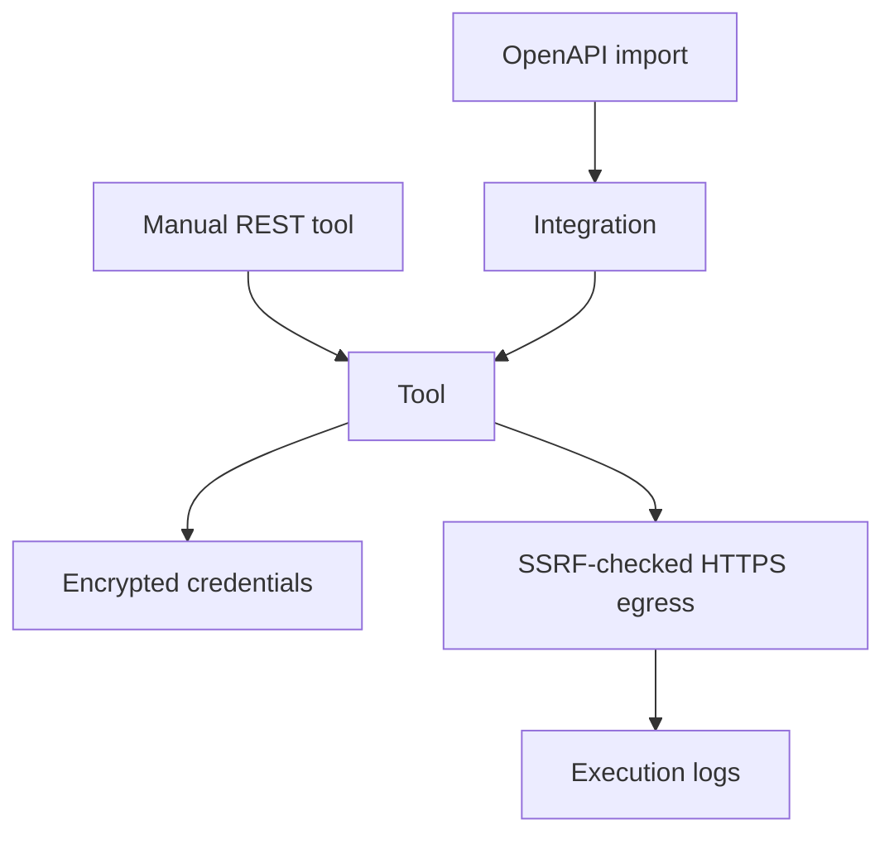

import {
  InfoBox,
  Warning,
  RelatedTopics,
  FaqAccordion,
  WorkflowCard,
  ApiEndpointCard,
} from '@site/src/components';

# Business Tools

**Business Tools** are workspace-scoped connectors (REST APIs and OpenAPI imports) that the assistant can invoke as **Business Actions**. Credentials are stored encrypted server-side. Qefro does not become your CRM/ERP — tools call *your* systems of record.

## Introduction

Admin Console → workspace → integrations/tools. REST surface (authenticated with the user’s Admin Console JWT):

| Method | Path |
| --- | --- |
| GET/POST | `/api/v1/workspaces/:workspace_id/integrations` |
| POST | `/api/v1/workspaces/:workspace_id/integrations/import/preview` |
| POST | `/api/v1/workspaces/:workspace_id/integrations/import/preview/upload` |
| POST | `/api/v1/workspaces/:workspace_id/integrations/import/apply` |
| GET/PATCH/DELETE | `/api/v1/integrations/:id` |
| POST | `/api/v1/integrations/:id/reimport` |
| GET/POST | `/api/v1/workspaces/:workspace_id/tools` |
| GET/PATCH/DELETE | `/api/v1/tools/:id` |
| POST | `/api/v1/tools/:id/test` |
| GET | `/api/v1/tools/:id/logs` |

Plan limits (from domain `PlanDefinition.business_tools_limit`):

| Plan | Business Tools |
| --- | --- |
| Free | 1 |
| Starter | 5 |
| Growth / Enterprise | Unlimited (`-1`) |

## Why it exists

Most chatbots only answer from documents. Qefro also executes configured actions (order status, ticket create, …) under RBAC, SSRF protections, and execution logs.

## Concepts

- **Integration** — connector grouping (often from OpenAPI)
- **Tool** — invocable operation (method, URL template, auth)
- **Execution log** — audit trail for tool runs (`/api/v1/tools/:id/logs`)
- **Test** — `POST /api/v1/tools/:id/test` (rate-limited)

## Architecture



## Workflow

<WorkflowCard
  title="Add a tool"
  steps={[
    {title: 'Choose workspace', description: 'Tools are workspace-scoped.'},
    {title: 'Import or create', description: 'OpenAPI preview/apply or manual REST tool.'},
    {title: 'Store secrets', description: 'API keys / OAuth material encrypted at rest.'},
    {title: 'Test', description: 'POST /api/v1/tools/:id/test from the console.'},
    {title: 'Monitor', description: 'Review /logs after production traffic.'},
  ]}
/>

## Code examples

```bash
# List tools for a workspace
curl -sS -H "Authorization: Bearer $USER_JWT" \
  https://api.qefro.com/api/v1/workspaces/$WORKSPACE_ID/tools

# Test a tool
curl -sS -X POST -H "Authorization: Bearer $USER_JWT" \
  https://api.qefro.com/api/v1/tools/$TOOL_ID/test \
  -H 'Content-Type: application/json' \
  -d '{}'
```

<ApiEndpointCard
  method="POST"
  path="/api/v1/workspaces/:workspace_id/integrations/import/apply"
  description="Apply a previously previewed OpenAPI import into integrations/tools."
/>

## Best practices

- Prefer read-only tools during pilots
- Re-import OpenAPI after upstream API changes (`/reimport`)
- Keep customer-facing tools separate from privileged internal tools (different workspaces)

## Security notes

<Warning>
Outbound tool URLs are SSRF-validated (HTTPS, blocked private/link-local targets, DNS pinning for webhooks). Do not disable these controls for convenience.
</Warning>

MCP connectors are on the roadmap — not required for REST/OpenAPI today.

## FAQ

<FaqAccordion
  items={[
    {
      question: 'What is the difference between Business Tools and Business Actions?',
      answer:
        'Tools are the configured connectors. Actions are the runtime invocations the AI performs using those tools.',
    },
    {
      question: 'How does identify() relate?',
      answer:
        'Website end-user JWT/session can be forwarded into tool calls so your API authorizes the real customer.',
    },
  ]}
/>

## Related topics

<RelatedTopics
  topics={[
    {label: 'Business Actions', to: '/docs/platform/business-actions'},
    {label: 'Import OpenAPI', to: '/docs/guides/import-openapi'},
    {label: 'Connect REST APIs', to: '/docs/guides/connect-rest-apis'},
    {label: 'Identity Forwarding', to: '/docs/platform/identity-forwarding'},
    {label: 'Security Overview', to: '/docs/security/overview'},
  ]}
/>
