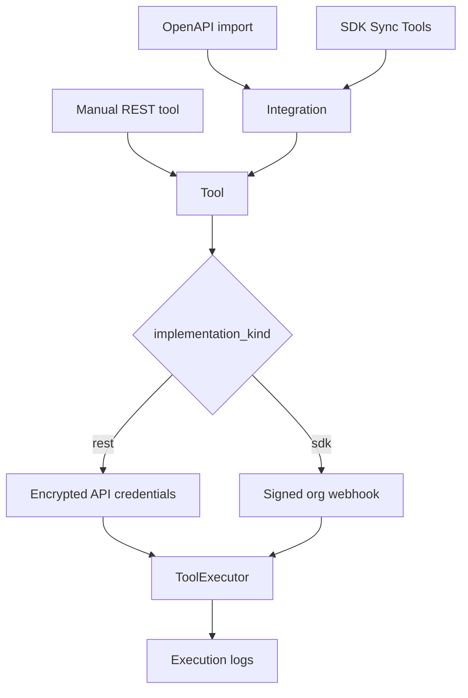

import {
  InfoBox,
  Warning,
  RelatedTopics,
  FaqAccordion,
  WorkflowCard,
  ApiEndpointCard,
} from '@site/src/components';

# Business Tools

**Business Tools** are workspace-scoped connectors the assistant can invoke as **Business Actions**. There are two implementation paths:

| Path | How you add tools | Credentials |
| --- | --- | --- |
| **REST / OpenAPI** | Manual tool or OpenAPI import | Encrypted API key / bearer on the tool |
| **SDK** | `@qefro-ai/backend` / `qefro-backend-sdk` handlers + Sync Tools | Connection signing secret; customer auth in your code |

Qefro does not become your CRM/ERP — tools call *your* systems of record.

## Introduction

Admin Console → **Business Tools** (REST / OpenAPI / SDK Connections tabs). REST surface (authenticated with the user’s Admin Console JWT):

| Method | Path |
| --- | --- |
| GET/POST | `/api/v1/workspaces/:workspace_id/integrations` |
| POST | `/api/v1/workspaces/:workspace_id/integrations/import/preview` |
| POST | `/api/v1/workspaces/:workspace_id/integrations/import/preview/upload` |
| POST | `/api/v1/workspaces/:workspace_id/integrations/import/apply` |
| GET/PATCH/DELETE | `/api/v1/integrations/:id` |
| POST | `/api/v1/integrations/:id/reimport` |
| GET/POST | `/api/v1/workspaces/:workspace_id/tools` |
| GET/PATCH/DELETE | `/api/v1/tools/:id` |
| POST | `/api/v1/tools/:id/test` |
| GET | `/api/v1/tools/:id/logs` |
| GET/POST | `/api/v1/org/sdk-connections` |
| PATCH/DELETE | `/api/v1/org/sdk-connections/:id` |
| POST | `/api/v1/org/sdk-connections/:id/test` |
| POST | `/api/v1/org/sdk-connections/:id/sync-tools` |

Plan limits (from domain `PlanDefinition.business_tools_limit`):

| Plan | Business Tools |
| --- | --- |
| Free | 1 |
| Starter | 5 |
| Growth / Enterprise | Unlimited (`-1`) |

## Why it exists

Most chatbots only answer from documents. Qefro also executes configured actions (order status, ticket create, …) under RBAC, SSRF protections, and execution logs.

## Concepts

- **Integration** — connector grouping (REST, OpenAPI import, or auto-created `SDK: {name}`)
- **Tool** — invocable operation (`implementation_kind`: `rest` or `sdk`)
- **SDK Connection** — org webhook + signing secret for `@qefro-ai/backend` / `qefro-backend-sdk`
- **Execution log** — audit trail for tool runs (`/api/v1/tools/:id/logs`)
- **Test** — `POST /api/v1/tools/:id/test` (rate-limited)

## Business Tool Execution (channels)

| Channel | Status |
| --- | --- |
| **Website Widget** | Supported |
| **WhatsApp** | Supported |
| **Internal Portal** | Not supported (V1) |

**Reason:** Internal Portal Business Tool execution requires delegated employee authentication, enterprise identity integration, and user authorization models, which are planned for a future release.

Knowledge search, RAG, document Q&A, AI assistance, and internal documentation remain fully supported in the Internal Portal. The Internal Portal stays an AI Knowledge Assistant in V1.

Admin Console **Test Tool** continues to work for configuring connectors — that path is not a chat channel.

## Architecture



## Workflow

<WorkflowCard
  title="Add a tool"
  steps={[
    {title: 'Choose workspace', description: 'Tools are workspace-scoped.'},
    {title: 'Pick a path', description: 'REST, OpenAPI import, or SDK handlers + Sync.'},
    {title: 'Store secrets', description: 'API keys on REST tools, or signing secret on the SDK connection.'},
    {title: 'Test', description: 'POST /api/v1/tools/:id/test from the console.'},
    {title: 'Monitor', description: 'Review /logs after production traffic.'},
  ]}
/>

## Code examples

```bash
# List tools for a workspace
curl -sS -H "Authorization: Bearer $USER_JWT" \
  https://api.qefro.com/api/v1/workspaces/$WORKSPACE_ID/tools

# Test a tool
curl -sS -X POST -H "Authorization: Bearer $USER_JWT" \
  https://api.qefro.com/api/v1/tools/$TOOL_ID/test \
  -H 'Content-Type: application/json' \
  -d '{}'
```

<ApiEndpointCard
  method="POST"
  path="/api/v1/workspaces/:workspace_id/integrations/import/apply"
  description="Apply a previously previewed OpenAPI import into integrations/tools."
/>

<ApiEndpointCard
  method="POST"
  path="/api/v1/org/sdk-connections/:id/sync-tools"
  description="Discover SDK handlers via tools.list; optionally auto-register as Business Tools."
/>

## Best practices

- Prefer read-only tools during pilots
- Re-import OpenAPI after upstream API changes (`/reimport`)
- Re-Sync SDK tools after you add or rename handlers
- Keep customer-facing tools separate from privileged internal tools (different workspaces)

## Security notes

<Warning>
Outbound tool URLs and SDK webhooks are SSRF-validated (HTTPS, blocked private/link-local targets). Do not disable these controls for convenience.
</Warning>

MCP connectors are on the roadmap — not required for REST/OpenAPI/SDK today.

## FAQ

<FaqAccordion
  items={[
    {
      question: 'Can employees run Business Tools from the Internal Portal?',
      answer:
        'Not in V1. Business Tool execution is supported on the Website Widget and WhatsApp only. The Internal Portal remains a knowledge / RAG assistant until employee delegated authentication ships.',
    },
    {
      question: 'What is the difference between Business Tools and Business Actions?',
      answer:
        'Tools are the configured connectors. Actions are the runtime invocations the AI performs using those tools.',
    },
    {
      question: 'REST vs SDK?',
      answer:
        'Use REST/OpenAPI for existing HTTPS APIs with API keys. Use the SDK when customer authentication or custom workflows belong in your backend code. See Register SDK Business Tools.',
    },
    {
      question: 'How does identify() relate?',
      answer:
        'Website end-user JWT/session can be forwarded into REST tool calls (END_USER_IDENTITY) and into SDK identity payloads so your API or authorize() can recognize the real customer.',
    },
  ]}
/>

## Related topics

<RelatedTopics
  topics={[
    {label: 'Register SDK Business Tools', to: '/docs/guides/register-sdk-business-tools'},
    {label: 'Business Actions', to: '/docs/platform/business-actions'},
    {label: 'Import OpenAPI', to: '/docs/guides/import-openapi'},
    {label: 'Connect REST APIs', to: '/docs/guides/connect-rest-apis'},
    {label: 'SDK Framework', to: '/docs/v1/sdk-framework'},
    {label: 'Identity Verification', to: '/docs/platform/identity-verification'},
    {label: 'Identity Forwarding', to: '/docs/platform/identity-forwarding'},
    {label: 'Security Overview', to: '/docs/security/overview'},
  ]}
/>
