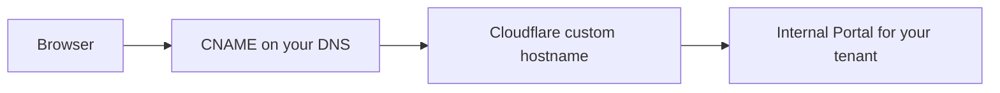

import {
  InfoBox,
  Warning,
  RelatedTopics,
  FaqAccordion,
  WorkflowCard,
} from '@site/src/components';

# Custom Domains

**Custom domains** let employees open the Internal Portal on a hostname you own (for example `ai.yourcompany.com`) instead of only `your-company.qefro.com`.

## Short definition (citation-ready)

> Qefro portal custom domains use Cloudflare custom hostnames so your DNS CNAME terminates TLS and routes to your organization’s Internal Portal.

## Default vs custom

| Mode | Example |
| --- | --- |
| Default | `acme.qefro.com` |
| Custom | `ai.acme.com` → CNAME to console-provided target (commonly an `org.qefro.com`-style host) |

Step-by-step: [Enable Custom Domains](/docs/guides/enable-custom-domains).

## Architecture

## Workflow

<WorkflowCard
  title="Attach a custom domain"
  steps={[
    {title: 'Confirm portal works on *.qefro.com', description: 'RBAC first.'},
    {title: 'Add hostname in Admin Console', description: 'Copy CNAME target.'},
    {title: 'Create DNS CNAME', description: 'Wait for propagation.'},
    {title: 'Wait for TLS active', description: 'Then smoke-test Member login.'},
    {title: 'Announce URL', description: 'Update internal bookmarks.'},
  ]}
/>

## Best practices

- Prefer a subdomain over apex (`@`) records
- Treat domain changes as security-sensitive (phishing risk if misconfigured)
- Keep branding aligned ([Branding](/docs/platform/branding))

<Warning>
A custom domain still maps to **one tenant**. Do not point multiple customers at one organization.
</Warning>

## FAQ

<FaqAccordion
  items={[
    {
      question: 'Does this affect docs.qefro.com or the marketing site?',
      answer:
        'No. Custom domains here are for the Internal Portal only.',
    },
    {
      question: 'Can I use the apex domain?',
      answer:
        'Possible at some DNS providers, but subdomains are strongly preferred.',
    },
  ]}
/>

## Related topics

<RelatedTopics
  topics={[
    {label: 'Enable Custom Domains', to: '/docs/guides/enable-custom-domains'},
    {label: 'Internal Portal', to: '/docs/platform/internal-portal'},
    {label: 'Branding', to: '/docs/platform/branding'},
    {label: 'Employee AI', to: '/docs/platform/employee-ai'},
    {label: 'Tenant Isolation', to: '/docs/security/tenant-isolation'},
  ]}
/>
