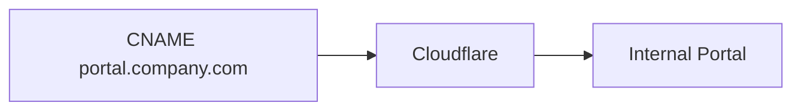

import {
  InfoBox,
  Warning,
  RelatedTopics,
  FaqAccordion,
  WorkflowCard,
  ApiEndpointCard,
} from '@site/src/components';

# Custom Domains


**Custom Domains** map a hostname you control to the Internal Portal. In product settings the CNAME target defaults to `org.qefro.com` (see Admin Console → Custom Domain). Your `your-company.qefro.com` subdomain continues to work.

## Introduction

Typical flow: add hostname → create DNS CNAME → wait for certificate → verify in console. Remove unused hostnames promptly.

## Why it exists

Enterprises often require `portal.company.com` instead of `company.qefro.com`.

## Concepts

- Custom hostname
- CNAME target
- TLS via Cloudflare

## Architecture



## Workflow

<WorkflowCard title="Attach a domain" steps={[
  {title: 'Add domain in Settings', description: 'Custom Domain section.'},
  {title: 'Create CNAME', description: 'Point to the shown target (e.g. org.qefro.com).'},
  {title: 'Wait for TLS', description: 'Complete verification in console.'},
]} />

## Code examples

```text
portal.example.com  CNAME  org.qefro.com
```

## Best practices

- Use a dedicated subdomain (`portal.` / `ai.`)
- Document DNS owners in your runbook

## Security notes

<Warning>
Only attach domains you control. Remove domains when contracts end.
</Warning>

## FAQ

<FaqAccordion items={[
  {question: 'Does custom domain affect the API?', answer: 'No — API remains api.qefro.com. Domain is for the employee portal host.'},
]} />

## Related topics

<RelatedTopics topics={[
  {label: 'Internal Portal', to: '/docs/platform/internal-portal'},
  {label: 'Enable Custom Domains', to: '/docs/guides/enable-custom-domains'},
  {label: 'Branding', to: '/docs/platform/branding'},
]} />


