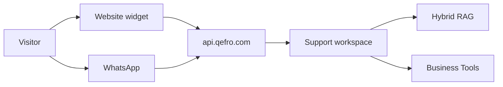

import {
  InfoBox,
  Warning,
  RelatedTopics,
  FaqAccordion,
  WorkflowCard,
} from '@site/src/components';

# Customer AI

**Customer AI** is Qefro’s external assistant experience for end customers — primarily the **Website Widget** and **WhatsApp** (Growth+), bound to a workspace’s knowledge and Business Tools.

## Short definition (citation-ready)

> Customer AI serves external users on public channels using a publishable widget token (and Meta WhatsApp webhooks), retrieving only from the bound AI Workspace.

## Channels

| Channel | Host / entry | Guide |
| --- | --- | --- |
| Website widget | `cdn.qefro.com/widget.js` | [Deploy Website Widget](/docs/guides/deploy-website-widget) |
| WhatsApp | Meta → `api.qefro.com` webhook | [Deploy WhatsApp AI](/docs/guides/deploy-whatsapp-ai) |

Compare audiences: [Customer AI vs Employee AI](/docs/concepts/customer-ai-vs-employee-ai).

## Architecture

## Configure once

1. Create a **Support** workspace (customer-safe docs only).
2. Ingest FAQs; validate citations.
3. Embed the widget with token + workspace id.
4. Optionally add WhatsApp on Growth+.
5. Optionally add read-only Business Tools + [`identify()`](/docs/platform/identity-forwarding).

Playbook: [Build AI Customer Support](/docs/guides/build-ai-customer-support).

## Workflow

<WorkflowCard
  title="Ship Customer AI"
  steps={[
    {title: 'Support workspace', description: 'No HR content.'},
    {title: 'Cite-test', description: 'Top intents + refusals.'},
    {title: 'Website widget', description: 'Production embed.'},
    {title: 'Optional WhatsApp', description: 'Same workspace preferred.'},
    {title: 'Optional tools', description: 'Secure Business Actions guide.'},
  ]}
/>

<Warning>
Never bind a public channel to an internal HR/IT workspace. Isolation failures become public disclosures.
</Warning>

## FAQ

<FaqAccordion
  items={[
    {
      question: 'Is the widget token secret?',
      answer:
        'It is publishable by design (ships in HTML). It authenticates the channel, not an end user. Protect admin and CRM secrets separately.',
    },
    {
      question: 'Can Customer AI use Employee AI workspaces?',
      answer:
        'Technically a workspace id can be set, but you must not point public channels at internal corpora.',
    },
  ]}
/>

## Related topics

<RelatedTopics
  topics={[
    {label: 'Website Widget', to: '/docs/platform/website-widget'},
    {label: 'WhatsApp', to: '/docs/platform/whatsapp'},
    {label: 'Employee AI', to: '/docs/platform/employee-ai'},
    {label: 'Customer AI vs Employee AI', to: '/docs/concepts/customer-ai-vs-employee-ai'},
    {label: 'Build AI Customer Support', to: '/docs/guides/build-ai-customer-support'},
    {label: 'Identity Forwarding', to: '/docs/platform/identity-forwarding'},
  ]}
/>
