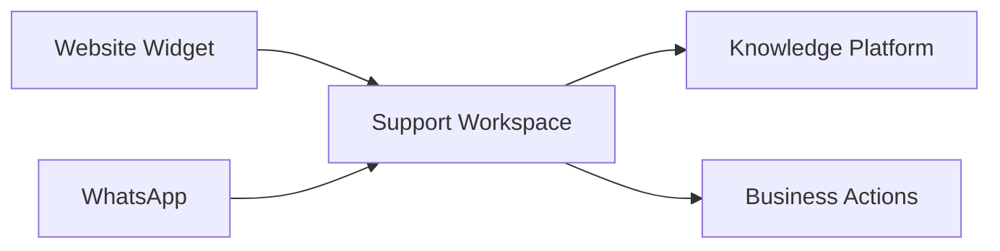

import {
  InfoBox,
  RelatedTopics,
  FaqAccordion,
  WorkflowCard,
} from '@site/src/components';

# Customer AI

**Customer AI** is Qefro’s external assistant experience for end customers — primarily the **Website Widget** and **WhatsApp** (Growth+), bound to a workspace’s knowledge and Business Tools.

## Introduction

Configure once in the Admin Console:

- Knowledge + instructions on a Customer Support workspace
- Widget embed (`cdn.qefro.com/widget.js`) with `data-workspace-id`
- Optional WhatsApp Cloud API webhook at `POST /api/v1/whatsapp/webhook`
- Optional lead capture, handoff, and CRM hooks under tenant settings

## Why it exists

Support teams need consistent answers across website and messaging without maintaining separate bots per channel.

## Concepts

- **Channel** — widget or WhatsApp → same workspace knowledge plane
- **Lead capture** — `POST /api/v1/widget/leads`
- **Handoff** — `POST /api/v1/widget/conversations/:id/handoff` (+ tenant handoff config)
- **Feedback** — `POST /api/v1/widget/messages/:id/feedback`

## Architecture

## Workflow

<WorkflowCard
  title="Launch Customer AI"
  steps={[
    {title: 'Workspace + knowledge', description: 'Upload FAQs, policies, product docs.'},
    {title: 'Widget', description: 'Embed and test anonymous chat.'},
    {title: 'Optional tools', description: 'Add read-only Business Tools + identify() if needed.'},
    {title: 'WhatsApp', description: 'Growth+ — map phone number to workspace.'},
  ]}
/>

## Code examples

See [Website Widget](/docs/platform/website-widget) for embed and `identify()` examples.

## Best practices

- Keep Internal HR knowledge out of the Customer Support workspace
- Enable handoff when the assistant should escalate to humans
- Review analytics and feedbacks weekly after launch

## Security notes

<InfoBox>
Widget traffic is rate-limited and message-quota enforced (`check_messages_limit_widget`). Plan conversation limits apply.
</InfoBox>

## FAQ

<FaqAccordion
  items={[
    {
      question: 'Is WhatsApp on Free?',
      answer: 'WhatsApp is available on Growth and above.',
    },
  ]}
/>

## Related topics

<RelatedTopics
  topics={[
    {label: 'Website Widget', to: '/docs/platform/website-widget'},
    {label: 'WhatsApp', to: '/docs/platform/whatsapp'},
    {label: 'Build AI Customer Support', to: '/docs/guides/build-ai-customer-support'},
    {label: 'Employee AI', to: '/docs/platform/employee-ai'},
  ]}
/>
