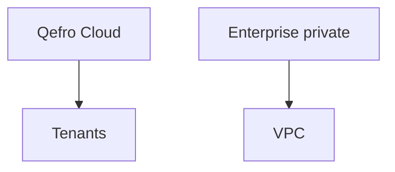

import {
  InfoBox,
  Warning,
  RelatedTopics,
  FaqAccordion,
  WorkflowCard,
  ApiEndpointCard,
} from '@site/src/components';

# Deployment


**Deployment** for most customers is fully managed:

| Component | Production host |
| --- | --- |
| Admin Console | https://app.qefro.com |
| API | https://api.qefro.com |
| Widget CDN | https://cdn.qefro.com/widget.js |
| Internal Portal | `your-company.qefro.com` or custom domain |
| Docs | https://docs.qefro.com / Cloudflare Pages |

Private / VPC deployment is an **Enterprise** option — contact Sales.

## Introduction

You configure product behavior in the Admin Console; Qefro operates API, RAG, and tool-execution infrastructure.

## Why it exists

Teams want AI Workspaces without staffing platform SRE for LLM gateways and vector stores.

## Concepts

- Managed cloud tenant
- Enterprise private deploy
- Static docs site (this repository)

## Architecture



## Workflow

<WorkflowCard title="Production checklist" steps={[
  {title: 'Knowledge QA', description: 'Citations and refusals look right.'},
  {title: 'Channels', description: 'Widget/WhatsApp/portal tested.'},
  {title: 'Tools', description: 'Least privilege + logs.'},
  {title: 'RBAC', description: 'Members scoped correctly.'},
  {title: 'Billing', description: 'Plan limits match expected traffic.'},
]} />

## Code examples

```bash
curl -sS https://api.qefro.com/health
curl -sS https://api.qefro.com/ready
```

## Best practices

- Maintain a staging organization for experiments
- Track widget token rotations in your release notes

## Security notes

<InfoBox>
SOC 2 is on the roadmap — ask Sales for the current timeline. SSO/SAML is on the Enterprise roadmap.
</InfoBox>

## FAQ

<FaqAccordion items={[
  {question: 'Can I self-host the open components?', answer: 'Cloud is the default product. Discuss private deployment with Sales for Enterprise needs.'},
]} />

## Related topics

<RelatedTopics topics={[
  {label: 'Production Deployment guide', to: '/docs/guides/production-deployment'},
  {label: 'Security Overview', to: '/docs/security/overview'},
  {label: 'Installation', to: '/docs/getting-started/installation'},
]} />


