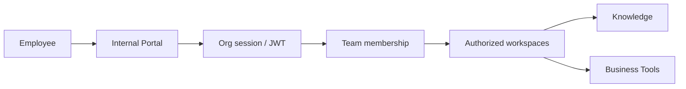

import {
  InfoBox,
  RelatedTopics,
  FaqAccordion,
  WorkflowCard,
} from '@site/src/components';

# Employee AI

**Employee AI** is Qefro’s internal assistant experience. Employees sign in to the **Internal Portal** (`your-company.qefro.com` or a custom domain) and chat with workspaces their **teams** grant them access to.

## Introduction

Unlike the public widget:

- Users authenticate as org members (Owner / Admin / Member)
- Access is RBAC + team → workspace mapping
- Chat uses authenticated APIs (`POST /api/v1/chat`, `/api/v1/chat/stream`, WebSocket patterns for portal clients)
- Branding comes from tenant settings (`GET /api/v1/public/tenant-branding`)

## Why it exists

Employees need the same knowledge platform and Business Actions with stronger identity and tighter workspace grants than anonymous website visitors.

## Concepts

- **Internal Portal** — employee web app
- **Tenant slug** — `your-company.qefro.com`
- **Team workspace grants** — Members only see authorized workspaces
- **Document write** — Members need team write permission to upload

## Architecture



## Workflow

<WorkflowCard
  title="Enable Employee AI"
  steps={[
    {title: 'Set slug / domain', description: 'Settings → portal URL and optional custom domain.'},
    {title: 'Create internal workspaces', description: 'HR, IT, Finance — separate from Customer Support.'},
    {title: 'Configure teams', description: 'Organization → Teams → members + workspaces.'},
    {title: 'Invite employees', description: 'Team invite APIs / Admin Console invitations.'},
  ]}
/>

## Code examples

```bash
# Public branding for portal bootstrap
curl -sS "https://api.qefro.com/api/v1/public/tenant-branding?slug=your-company"
```

## Best practices

- Never reuse the Customer Support workspace for HR
- Grant Members least workspace access
- Use org audit logs for sensitive membership changes

## Security notes

<InfoBox>
Owners/Admins can access all workspaces. Members cannot invite users, manage billing, or see secrets.
</InfoBox>

## FAQ

<FaqAccordion
  items={[
    {
      question: 'Is the portal a separate product?',
      answer:
        'No — same organization, knowledge platform, and Business Tools. Different experience and auth path.',
    },
  ]}
/>

## Related topics

<RelatedTopics
  topics={[
    {label: 'Internal Portal', to: '/docs/platform/internal-portal'},
    {label: 'RBAC', to: '/docs/platform/rbac'},
    {label: 'Custom Domains', to: '/docs/platform/custom-domains'},
    {label: 'Create Employee AI', to: '/docs/guides/create-employee-ai'},
  ]}
/>
