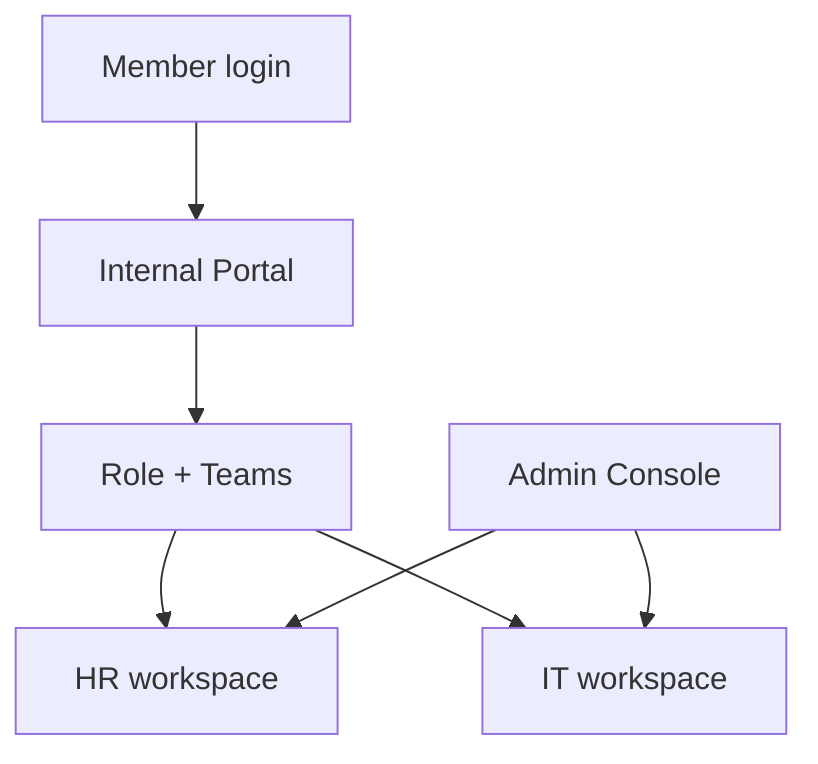

import {
  InfoBox,
  Warning,
  RelatedTopics,
  FaqAccordion,
  WorkflowCard,
} from '@site/src/components';

# Employee AI

**Employee AI** is Qefro’s internal assistant experience. Employees sign in to the **Internal Portal** (`your-company.qefro.com` or a custom domain) and chat with workspaces their **Teams** grant.

## Short definition (citation-ready)

> Employee AI authenticates organization members and authorizes workspace access through RBAC and Teams, unlike Customer AI which uses public channel tokens.

## How it differs from Customer AI

| | Customer AI | Employee AI |
| --- | --- | --- |
| Users | External | Org members |
| Surface | Widget / WhatsApp | Internal Portal |
| Auth | Widget token (+ optional identify) | Session JWT |
| Access | Workspace id in embed | Team grants |

Concept: [Customer AI vs Employee AI](/docs/concepts/customer-ai-vs-employee-ai).

## Architecture

## Workflow

<WorkflowCard
  title="Stand up Employee AI"
  steps={[
    {title: 'Create internal workspaces', description: 'Separate from Support.'},
    {title: 'Ingest internal docs', description: 'Cite-test with staff.'},
    {title: 'Configure Teams/RBAC', description: 'Least privilege grants.'},
    {title: 'Brand portal', description: 'Logo and colors.'},
    {title: 'Optional custom domain', description: 'ai.yourcompany.com.'},
  ]}
/>

Playbooks: [Create Employee AI](/docs/guides/create-employee-ai), [Configure RBAC](/docs/guides/configure-rbac).

<Warning>
Employee AI is not merely “Customer AI behind login.” Without Teams/grants, you either overshare workspaces or block users incorrectly.
</Warning>

## FAQ

<FaqAccordion
  items={[
    {
      question: 'Can customers use the portal?',
      answer:
        'No. Invite only organization members. Customers use widget/WhatsApp.',
    },
    {
      question: 'Can Employees use Business Tools?',
      answer:
        'Yes, when tools are attached to their granted workspaces — still apply Secure Business Actions practices.',
    },
  ]}
/>

## Related topics

<RelatedTopics
  topics={[
    {label: 'Internal Portal', to: '/docs/platform/internal-portal'},
    {label: 'Teams', to: '/docs/platform/teams'},
    {label: 'RBAC', to: '/docs/platform/rbac'},
    {label: 'Create Employee AI', to: '/docs/guides/create-employee-ai'},
    {label: 'Branding', to: '/docs/platform/branding'},
    {label: 'Custom Domains', to: '/docs/platform/custom-domains'},
  ]}
/>
