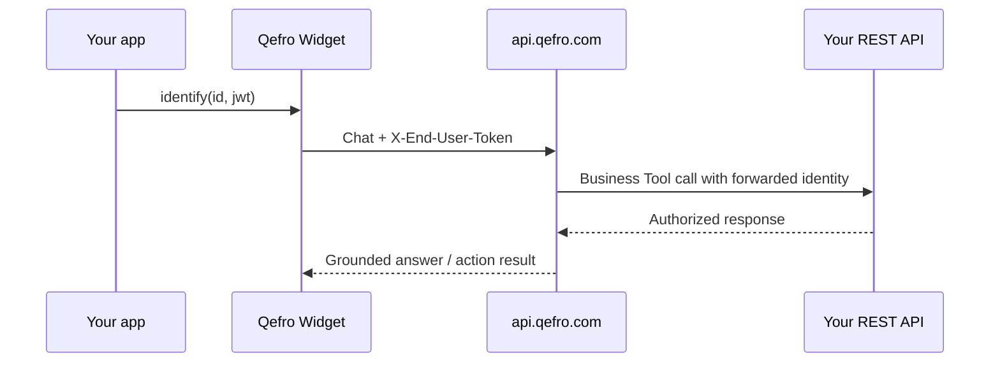

import {
  InfoBox,
  Warning,
  RelatedTopics,
  FaqAccordion,
  WorkflowCard,
} from '@site/src/components';

# Identity Forwarding

**Identity Forwarding** lets your host application tell Qefro who the website visitor is, so Business Actions can call your APIs in that user’s context. Qefro does **not** replace your auth system — you own JWT/session issuance.

## Introduction

Implemented in `@qefro-ai/widget` via:

- `widget.identify({ id, email?, name?, auth?: { mode, token } })`
- `widget.setAuthToken(jwt)` — refresh without restart
- `widget.clearIdentity()` — clears local identity and notifies `POST /api/v1/widget/identity/clear`

Auth modes:

| Mode | Token transport |
| --- | --- |
| `jwt` | Header `X-End-User-Token` / WS `endUserToken` |
| `session` | Header `X-End-User-Session` / WS `endUserSession` |
| `none` | Profile only (id/email/name) — no bearer secret |

## Why it exists

Order lookup, ticket creation, and account mutations must not run as a shared service account when the end user is logged into your product.

## Concepts

- **Host-owned identity** — your IdP / session store
- **Forwarded claims** — id, email, name + auth material for tool HTTP calls
- **Visitor session** — separate continuity key; clearing identity does not wipe chat history by default

## Architecture



## Workflow

<WorkflowCard
  title="Wire identify()"
  steps={[
    {title: 'Authenticate in your app', description: 'Issue JWT or session as you already do.'},
    {title: 'Call identify()', description: 'Pass stable user id + auth.mode/token.'},
    {title: 'Configure tools', description: 'Business Tools that need user context read forwarded headers/claims.'},
    {title: 'Logout', description: 'await widget.clearIdentity().'},
  ]}
/>

## Code examples

```javascript
widget.identify({
  id: user.id,
  email: user.email,
  name: user.name,
  auth: {
    mode: 'jwt',
    token: userJwt, // from YOUR auth system
  },
});

// Later
widget.setAuthToken(refreshedJwt);
await widget.clearIdentity();
```

Anonymous visitors: **do not** call `identify()`.

## Best practices

- Use a stable opaque user id (not email alone) as `id`
- Keep JWT lifetimes short; refresh with `setAuthToken`
- Scope Business Tools to least privilege when identity is present

## Security notes

<Warning>
Never put end-user tokens in `setContext()`. Context is product/page metadata; identity is a separate API (`identify`).
</Warning>

<InfoBox>
Tokens are sent on headers / WebSocket auth fields. They are not duplicated into the public identity JSON body.
</InfoBox>

## FAQ

<FaqAccordion
  items={[
    {
      question: 'Does Qefro validate my JWT signature?',
      answer:
        'Your APIs remain the source of truth for authorization. Qefro forwards identity material into configured Business Tool calls under your tool security settings.',
    },
    {
      question: 'Can Internal Portal users use identify()?',
      answer:
        'Internal Portal users authenticate as Qefro org members. identify() is the website widget path for your customers.',
    },
  ]}
/>

## Related topics

<RelatedTopics
  topics={[
    {label: 'Website Widget', to: '/docs/platform/website-widget'},
    {label: 'Business Actions', to: '/docs/platform/business-actions'},
    {label: 'Secure Business Actions', to: '/docs/guides/secure-business-actions'},
    {label: 'Authentication', to: '/docs/platform/authentication'},
  ]}
/>
