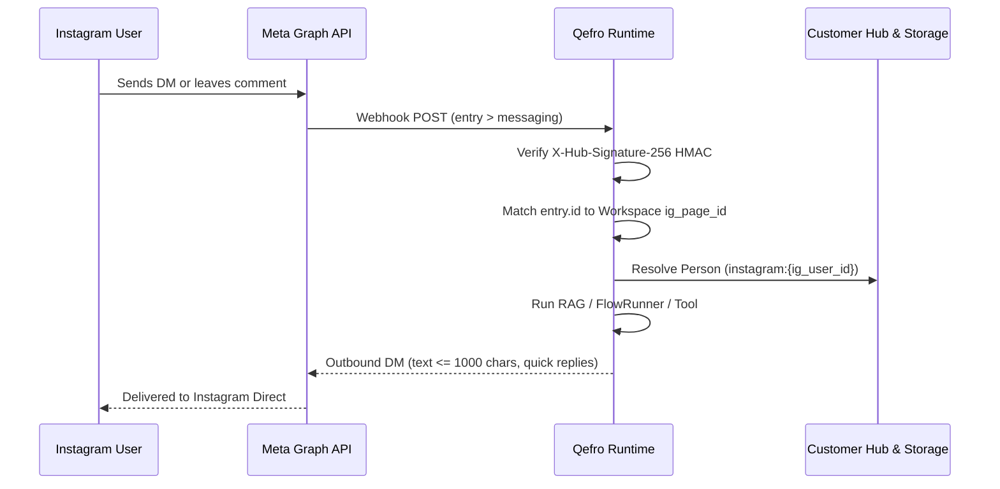

import { InfoBox, Warning, RelatedTopics } from '@site/src/components';

# Instagram Channel

Qefro integrates with Meta's **Instagram Messaging API** (`graph.instagram.com/v23.0`), enabling Customer AI assistants to engage with customers over Instagram Direct Messages (DMs) and privately reply to post comments.

---

## 1. Architecture & Inbound Webhooks

Each AI Workspace connects to exactly one Instagram Professional (Business or Creator) account. The platform exposes a single shared webhook endpoint and routes incoming messages to the owning workspace:

---

## 2. Workspace Configuration

Configure Instagram integration in **Workspace Settings ➔ Channels ➔ Instagram**:

| Setting | Field Name | Description |
|---|---|---|
| **Instagram Account ID** | `ig_page_id` | Instagram professional account ID (matches webhook `entry.id`). |
| **Access Token** | `access_token` | Long-lived Instagram User Access Token (AES-256-GCM encrypted). |
| **Verify Token** | `verify_token` | Webhook verification token for GET challenge. |
| **Meta App Secret** | `app_secret` | Used to verify `X-Hub-Signature-256` HMAC on inbound webhooks. |

---

## 3. Supported Channel Capabilities & Limits

Qefro adheres strictly to the constraints of the Instagram Messaging API:

| Feature | Supported | Specification / Platform Limits |
|---|---|---|
| **Text Messages** | **Yes** | Maximum **1,000 characters** per message (`IG_TEXT_MAX = 1000`). |
| **Quick Replies** | **Yes** | Up to **13 buttons** (`IG_QUICK_REPLY_MAX`), max **20 characters** per title. |
| **Media Attachments** | **Yes** | Image, video, audio, and documents referenced via **public HTTPS URL** (Instagram Messaging API has no media binary upload endpoint). |
| **Private Replies to Comments**| **Yes** | Respond directly and privately to comments left on Instagram posts or reels. |
| **24-Hour Messaging Window** | **Yes** | Outbound messages are permitted within 24 hours of the user's last interaction. |
| **Audio Transcription (STT)**| **Yes** | Voice messages received via DM are automatically transcribed and processed. |

:::warning Instagram Messaging Window
Meta enforces a strict **24-hour standard messaging window**. Outside this window, automated messages cannot be sent unless permitted by approved Meta message tags.
:::

---

## 4. Conversation & Identity Mapping

- **Session Format:** Inbound conversations are mapped to `session_id = "instagram:{ig_user_id}"`.
- **Customer Hub Link:** The user's Instagram username and profile ID are linked to a Customer Hub `Person` record (`channel: Instagram`).
- **Omnichannel Context:** If the customer later verifies their phone number or email via an OTP challenge, their Instagram identity is merged with their universal Person record, allowing seamless context across WhatsApp and the Website Widget.

---

## 5. Webhook Security

- **Webhook Verification:** `GET /api/v1/instagram/webhook` validates the `verify_token` challenge.
- **HMAC Signatures:** All incoming events must provide a valid `X-Hub-Signature-256` computed with the workspace's decrypted `app_secret`. Unsigned or mismatched requests are rejected immediately.

---

## Related Documentation

- [Channels Overview](/docs/user/channels/overview)
- [WhatsApp Channel](/docs/platform/whatsapp)
- [Customer Hub Person Identity](/docs/solutions/customer-hub)
- [FlowRunner State Machine](/docs/developer/concepts/flows)
