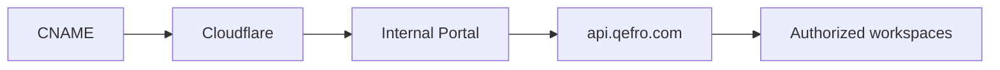

import {
  InfoBox,
  RelatedTopics,
  FaqAccordion,
  WorkflowCard,
} from '@site/src/components';

# Internal Portal

The **Internal Portal** is the employee-facing web app for Employee AI. Default host: `https://{tenantSlug}.qefro.com`. Optional custom domains terminate via Cloudflare (CNAME target defaults to `org.qefro.com` in product settings).

## Introduction

Portal bootstrap uses public branding:

- `GET /api/v1/public/tenant-branding`
- `GET /api/v1/public/tenant-slug-available`

Authenticated employees then use org chat/document APIs under their RBAC grants. Share links and branding are configured in Admin Console → Settings (Employee branding / Internal Portal).

## Why it exists

Employees need a first-party, branded chat experience — not a public website widget.

## Concepts

- **Tenant slug** — subdomain label
- **Custom hostname** — customer DNS → Cloudflare → portal
- **Branding** — logo/colors from tenant settings

## Architecture



## Workflow

<WorkflowCard
  title="Go live"
  steps={[
    {title: 'Choose slug', description: 'Ensure availability via public API.'},
    {title: 'Brand', description: 'Logo and colors for employees.'},
    {title: 'RBAC', description: 'Teams → workspaces.'},
    {title: 'Optional custom domain', description: 'CNAME + verify in Settings.'},
  ]}
/>

## Code examples

```bash
curl -sS "https://api.qefro.com/api/v1/public/tenant-slug-available?slug=acme"
```

## Best practices

- Communicate the portal URL in your IT onboarding docs
- Keep Customer Support widget traffic off employee-only workspaces

## Security notes

<InfoBox>
Custom domains should use HTTPS only. Remove unused hostnames promptly in Settings.
</InfoBox>

## FAQ

<FaqAccordion
  items={[
    {
      question: 'Can customers use the Internal Portal?',
      answer:
        'No — portal users are organization members. Customers use the website widget or WhatsApp.',
    },
  ]}
/>

## Related topics

<RelatedTopics
  topics={[
    {label: 'Employee AI', to: '/docs/platform/employee-ai'},
    {label: 'Custom Domains', to: '/docs/platform/custom-domains'},
    {label: 'Branding', to: '/docs/platform/branding'},
    {label: 'RBAC', to: '/docs/platform/rbac'},
  ]}
/>
