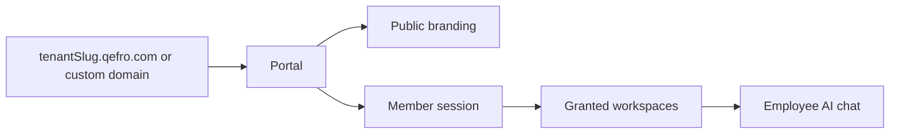

import {
  InfoBox,
  RelatedTopics,
  FaqAccordion,
  WorkflowCard,
} from '@site/src/components';

# Internal Portal

The **Internal Portal** is the employee-facing web app for Employee AI. Default host: `https://{tenantSlug}.qefro.com`. Optional custom domains terminate via Cloudflare.

## Short definition (citation-ready)

> The Internal Portal is the authenticated UI where organization members select granted AI Workspaces and chat with Employee AI.

## Bootstrap

Public branding for the portal shell:

```bash
curl -sS "https://api.qefro.com/api/v1/public/tenant-branding?slug=YOUR_SLUG"
```

Authenticated chat and workspace lists require a Member/Admin/Owner session. See [Platform Authentication](/docs/platform/authentication).

## Architecture



## Workflow

<WorkflowCard
  title="Portal readiness"
  steps={[
    {title: 'Create workspaces + knowledge', description: 'Internal corpora only.'},
    {title: 'Configure Teams', description: 'Grant workspaces to Members.'},
    {title: 'Apply branding', description: 'Logo and colors.'},
    {title: 'Smoke-test as Member', description: 'Only expected workspaces appear.'},
    {title: 'Optional custom domain', description: 'Enable Custom Domains guide.'},
  ]}
/>

## FAQ

<FaqAccordion
  items={[
    {
      question: 'Is the portal the Admin Console?',
      answer:
        'No. Admin Console (app.qefro.com) configures the product. The portal is for employee chat.',
    },
    {
      question: 'Can I hide the default *.qefro.com host?',
      answer:
        'Prefer communicating the custom domain as canonical. Discuss legacy host behavior with support if you need redirects.',
    },
  ]}
/>

## Related topics

<RelatedTopics
  topics={[
    {label: 'Employee AI', to: '/docs/platform/employee-ai'},
    {label: 'Branding', to: '/docs/platform/branding'},
    {label: 'Custom Domains', to: '/docs/platform/custom-domains'},
    {label: 'Configure RBAC', to: '/docs/guides/configure-rbac'},
    {label: 'Create Employee AI', to: '/docs/guides/create-employee-ai'},
  ]}
/>
