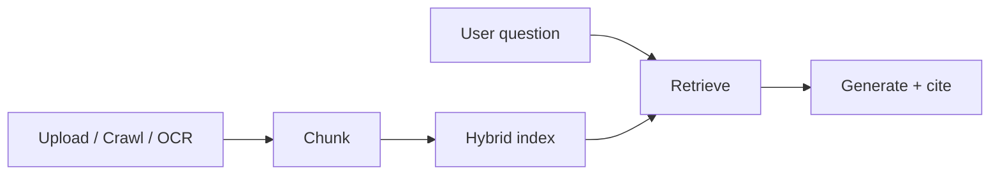

import {
  InfoBox,
  Warning,
  RelatedTopics,
  FaqAccordion,
  WorkflowCard,
} from '@site/src/components';

# Knowledge Platform

The **Knowledge Platform** indexes organizational content for retrieval-augmented generation (RAG). Uploads and crawls are chunked, embedded, and retrieved with **hybrid BM25 + vector** search. Answers include **citations**; the assistant is guided to refuse when no relevant source exists.

## Introduction

Ingest paths in the real API:

- `POST /api/v1/documents` — multipart upload (quota: `check_documents_limit`)
- `POST /api/v1/documents/text` — create from raw text
- `POST /api/v1/documents/:id/reindex` — rebuild index for a document
- GraphQL mutations for console workflows including **website crawl**
- `GET /api/v1/documents/:id/view` — authorized document view

Supported formats include PDF, DOCX, Markdown, TXT; OCR covers scans/images. Multilingual retrieval supports EN, AR, TA, HI and more.

## Why it exists

Customer AI and Employee AI must share one high-quality retrieval stack with hard **workspace isolation**.

## Concepts

- **Document / chunk / embedding** — indexed units
- **Hybrid retrieval** — lexical + vector
- **Citation** — source attribution in answers
- **Isolation** — workspace-scoped indexes

## Architecture



## Workflow

<WorkflowCard
  title="Improve answer quality"
  steps={[
    {title: 'Curate sources', description: 'Prefer canonical policies over stale copies.'},
    {title: 'Ingest', description: 'Upload or crawl; wait for indexing.'},
    {title: 'Probe', description: 'Ask known questions; verify citations.'},
    {title: 'Reindex', description: 'Use reindex after content corrections.'},
  ]}
/>

## Code examples

```bash
curl -sS -X POST \
  -H "Authorization: Bearer $USER_JWT" \
  -F "file=@policy.pdf" \
  -F "workspace_id=$WORKSPACE_ID" \
  https://api.qefro.com/api/v1/documents
```

## Best practices

- Separate customer vs employee corpora by workspace
- Re-test after every major document delete/replace
- Prefer crawl allowlists over unbounded domains

## Security notes

<Warning>
Deleting a document removes associated chunks/embeddings. Confirm before destructive operations in production workspaces.
</Warning>

## FAQ

<FaqAccordion
  items={[
    {
      question: 'Do I host the vector DB?',
      answer: 'Not on Qefro cloud — indexing and retrieval are platform-managed.',
    },
  ]}
/>

## Related topics

<RelatedTopics
  topics={[
    {label: 'AI Knowledge Platform (concept)', to: '/docs/concepts/ai-knowledge-platform'},
    {label: 'Hybrid RAG', to: '/docs/concepts/hybrid-rag'},
    {label: 'AI Workspaces', to: '/docs/platform/ai-workspaces'},
    {label: 'Quick Start', to: '/docs/getting-started/quick-start'},
    {label: 'Customer AI', to: '/docs/platform/customer-ai'},
    {label: 'Employee AI', to: '/docs/platform/employee-ai'},
  ]}
/>
