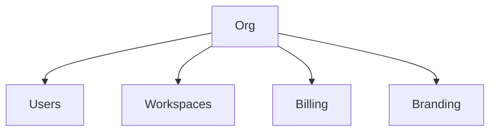

import {
  InfoBox,
  Warning,
  RelatedTopics,
  FaqAccordion,
  WorkflowCard,
} from '@site/src/components';

# Organizations

An **Organization** is the top-level tenant in Qefro.

## Introduction

Organizations is a core part of the Qefro AI Workspace Platform. This page defines the concept, how it fits the architecture, and how to operate it safely.

## Why it exists

Organizations need clear boundaries for organizations so Customer AI and Employee AI stay accurate, permissioned, and auditable.

## Concepts

- Definition aligned with Qefro terminology
- Relationship to workspaces, knowledge, and Business Actions
- Operational settings in the Admin Console

## Architecture

tenant isolation



## Workflow

<WorkflowCard
  title="Organizations workflow"
  steps={[
    {title: 'Plan', description: 'Decide ownership, scope, and success metrics.'},
    {title: 'Configure', description: 'Set this capability in the Admin Console.'},
    {title: 'Validate', description: 'Test happy path, refusal, and permission edges.'},
    {title: 'Monitor', description: 'Review analytics and execution logs.'},
  ]}
/>

## Code examples

```bash
# Typical console / API orientation
export QEFRO_APP=https://app.qefro.com
export QEFRO_API=https://api.qefro.com
```

```typescript
// Conceptual: resolve a workspace-scoped request
type WorkspaceContext = {
  organizationId: string;
  workspaceId: string;
  actorId: string;
};
```

## Best practices

- Prefer least privilege
- Separate customer-facing and employee-facing workspaces
- Document owners for each workspace and tool

## Security notes

<Warning>
Treat configuration changes as production changes. Review Business Tools and RBAC before go-live.
</Warning>

## FAQ

<FaqAccordion items={[
  {
    "question": "What is Organizations?",
    "answer": "An Organization is the top-level tenant in Qefro."
  },
  {
    "question": "Where do I configure it?",
    "answer": "In the Admin Console at app.qefro.com, under the relevant workspace or organization settings."
  }
]} />

## Related topics

<RelatedTopics topics={[
  {
    "label": "AI Workspaces",
    "to": "/docs/platform/ai-workspaces"
  },
  {
    "label": "Business Actions",
    "to": "/docs/platform/business-actions"
  },
  {
    "label": "Security Overview",
    "to": "/docs/security/overview"
  },
  {
    "label": "Glossary",
    "to": "/docs/glossary"
  }
]} />

