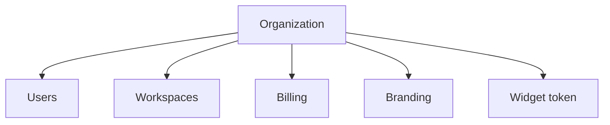

import {
  InfoBox,
  Warning,
  RelatedTopics,
  FaqAccordion,
  WorkflowCard,
  ApiEndpointCard,
} from '@site/src/components';

# Organizations


An **Organization** (tenant) is the top-level Qefro account created at signup on [app.qefro.com](https://app.qefro.com). It owns members, workspaces, billing (Razorpay), widget token, branding, and channel configs.

## Introduction

Multi-tenant isolation is enforced in the API: every authenticated request resolves `tenant_id` from the user JWT (or widget token). Super Admin APIs (`/api/v1/admin/tenants/*`) are platform-only.

## Why it exists

Billing, security, and data residency expectations attach to a company boundary — not to a single chatbot.

## Concepts

- Tenant / organization — same boundary in product language
- Plan — Free, Starter, Growth, Enterprise
- Slug — `your-company.qefro.com` Internal Portal host

## Architecture



## Workflow

<WorkflowCard title="Operate an org" steps={[
  {title: 'Create', description: 'Signup + verify email.'},
  {title: 'Invite', description: 'Add Admins/Members.'},
  {title: 'Configure', description: 'Workspaces, knowledge, tools, channels.'},
  {title: 'Bill', description: 'Upgrade via /api/v1/billing/checkout when ready.'},
]} />

## Code examples

```bash
curl -sS -H "Authorization: Bearer $USER_JWT" \
  https://api.qefro.com/api/v1/team/my-tenants
```

## Best practices

- One production org per company; use a separate org for experiments when possible
- Transfer ownership intentionally via `/api/v1/org/transfer-ownership`

## Security notes

<Warning>
Deleting or suspending a tenant is destructive. Prefer suspend (platform admin) over hard delete during incidents.
</Warning>

## FAQ

<FaqAccordion items={[
  {question: 'Can one user belong to multiple orgs?', answer: 'Yes — switch via /api/v1/team/switch-tenant and list with /api/v1/team/my-tenants.'},
]} />

## Related topics

<RelatedTopics topics={[
  {label: 'Teams', to: '/docs/platform/teams'},
  {label: 'RBAC', to: '/docs/platform/rbac'},
  {label: 'Deployment', to: '/docs/platform/deployment'},
]} />


