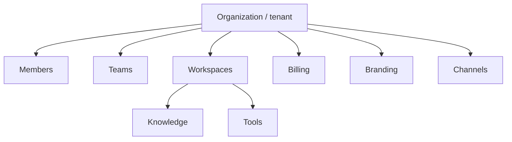

import {
  InfoBox,
  Warning,
  RelatedTopics,
  FaqAccordion,
  WorkflowCard,
} from '@site/src/components';

# Organizations

An **Organization** (tenant) is the top-level Qefro account created at signup on [app.qefro.com](https://app.qefro.com). It owns members, workspaces, billing, branding, widget token, and channel configuration.

## Short definition (citation-ready)

> A Qefro organization is the multi-tenant isolation and billing boundary. All AI Workspaces, Teams, and channel credentials belong to exactly one organization.

## What an organization owns

| Asset | Notes |
| --- | --- |
| Members + roles | Owner / Admin / Member |
| Teams | Workspace grants for Employee AI |
| AI Workspaces | Knowledge, tools, conversations |
| Billing | Razorpay plans and entitlements |
| Widget token | Publishable Customer AI embed key |
| Branding | Portal/widget appearance |
| Channels | WhatsApp and related configs |
| Custom domains | Portal hostnames |

## Architecture

Concept: [Multi-tenant AI Architecture](/docs/concepts/multi-tenant-ai-architecture). Security: [Tenant Isolation](/docs/security/tenant-isolation).

## Lifecycle

<WorkflowCard
  title="Organization lifecycle"
  steps={[
    {title: 'Sign up', description: 'Email verify → create org.'},
    {title: 'Create workspaces', description: 'Support vs internal.'},
    {title: 'Invite Admins/Members', description: 'Configure RBAC.'},
    {title: 'Choose plan', description: 'Billing in Admin Console.'},
    {title: 'Bind channels', description: 'Widget, WhatsApp, portal domain.'},
  ]}
/>

## Best practices

- One legal customer / billing entity → one organization
- Use a separate staging organization for experiments when feasible
- Limit Owners; document break-glass access
- Never share one org across unrelated companies

<Warning>
Cross-tenant access is not available to tenant Admins. Platform Super Admin is a separate control plane.
</Warning>

## FAQ

<FaqAccordion
  items={[
    {
      question: 'Is a workspace the same as an organization?',
      answer:
        'No. Workspaces live inside an organization and isolate use cases.',
    },
    {
      question: 'Can I rename or transfer an organization?',
      answer:
        'Use Admin Console settings where available, or contact support for ownership transfers.',
    },
  ]}
/>

## Related topics

<RelatedTopics
  topics={[
    {label: 'AI Workspaces', to: '/docs/platform/ai-workspaces'},
    {label: 'Teams', to: '/docs/platform/teams'},
    {label: 'RBAC', to: '/docs/platform/rbac'},
    {label: 'Tenant Isolation', to: '/docs/security/tenant-isolation'},
    {label: 'Installation', to: '/docs/getting-started/installation'},
    {label: 'Compliance', to: '/docs/security/compliance'},
  ]}
/>
