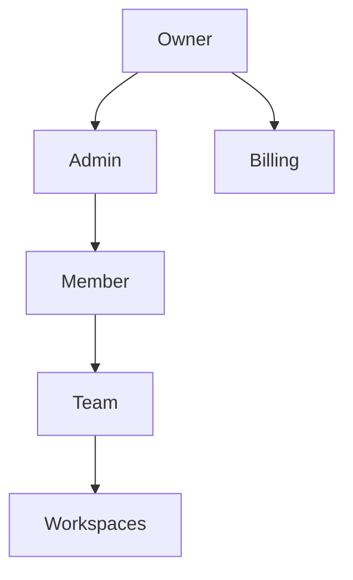

import {
  InfoBox,
  RelatedTopics,
  FaqAccordion,
  WorkflowCard,
} from '@site/src/components';

# RBAC

**RBAC** in Qefro uses organization roles **Owner**, **Admin**, and **Member**, plus **Teams** that grant Members access to specific **workspaces** (and optional document write).

## Introduction

Canonical role definitions (from product `RoleDefinition`):

### Owner
- Manage billing and subscription
- Transfer ownership / delete organization
- Manage all teams, members, workspaces
- Configure integrations and AI assistants
- Access all workspaces
- Cannot be removed by Admins

### Admin
- Access all workspaces; create/delete workspaces
- Manage teams and invite members
- Configure integrations and AI assistants
- Change member roles (except Owner)
- Cannot transfer ownership, change subscription owner, or delete the Owner

### Member
- Use AI + integrations only in authorized workspaces
- View teams they belong to
- Upload/manage documents **only** when granted team write
- Cannot invite users, manage teams, billing, secrets, or promote roles

REST (Admin Console JWT):

- `/api/v1/org/roles`, `/api/v1/org/members`, `/api/v1/org/teams`, …
- `/api/v1/org/teams/:id/workspaces`
- `/api/v1/org/workspaces/:id/teams`
- `/api/v1/org/audit-logs`
- `/api/v1/team/invite`, `/api/v1/team/accept-invite`, …

## Why it exists

Employee AI and Admin Console need least privilege. Public Customer AI uses widget tokens instead of org roles.

## Concepts

- **Org role** — Owner / Admin / Member
- **Team** — group of members
- **Workspace grant** — which workspaces a team can use
- **Write flag** — per team member document write

## Architecture



## Workflow

<WorkflowCard
  title="Configure RBAC"
  steps={[
    {title: 'Invite Admins/Members', description: 'Organization / Team invite flows.'},
    {title: 'Create teams', description: 'e.g. Support Agents, HR Staff.'},
    {title: 'Attach workspaces', description: 'PUT team workspaces / workspace teams.'},
    {title: 'Grant write sparingly', description: 'Only members who maintain knowledge.'},
  ]}
/>

## Code examples

```bash
curl -sS -H "Authorization: Bearer $USER_JWT" \
  https://api.qefro.com/api/v1/org/roles

curl -sS -H "Authorization: Bearer $USER_JWT" \
  https://api.qefro.com/api/v1/org/teams
```

## Best practices

- Prefer Admin over shared Owner logins
- Keep Customer Support tools off HR teams
- Audit role changes via `/api/v1/org/audit-logs`

## Security notes

<InfoBox>
Plan seat limits (`users_limit`) still apply on Free/Starter/Growth — RBAC does not bypass quotas.
</InfoBox>

## FAQ

<FaqAccordion
  items={[
    {
      question: 'Can Members see all workspaces?',
      answer: 'No. Only workspaces granted through their teams. Owners/Admins see all.',
    },
  ]}
/>

## Related topics

<RelatedTopics
  topics={[
    {label: 'Teams', to: '/docs/platform/teams'},
    {label: 'Organizations', to: '/docs/platform/organizations'},
    {label: 'Configure RBAC', to: '/docs/guides/configure-rbac'},
    {label: 'Employee AI', to: '/docs/platform/employee-ai'},
  ]}
/>
