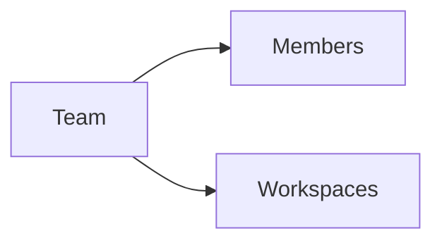

import {
  InfoBox,
  Warning,
  RelatedTopics,
  FaqAccordion,
  WorkflowCard,
  ApiEndpointCard,
} from '@site/src/components';

# Teams


**Teams** organize Members inside an organization and grant access to workspaces. Owners/Admins manage teams; Members only see teams they belong to.

## Introduction

REST: `GET/POST /api/v1/org/teams`, `PUT .../members`, `PUT .../workspaces`, and per-member write flags.

## Why it exists

Employee AI needs scalable access control without making everyone an Admin.

## Concepts

- Team membership
- Workspace grants
- Document write permission

## Architecture



## Workflow

<WorkflowCard title="Team setup" steps={[
  {title: 'Create team', description: 'Name by department.'},
  {title: 'Add members', description: 'Invite then assign.'},
  {title: 'Attach workspaces', description: 'Least privilege.'},
]} />

## Code examples

```bash
curl -sS -H "Authorization: Bearer $USER_JWT" \
  https://api.qefro.com/api/v1/org/teams
```

## Best practices

- Mirror real departments (Support, HR, IT)
- Avoid putting all Members on one mega-team

## Security notes

<InfoBox>
Granting a team a workspace also grants its Business Tools in that workspace.
</InfoBox>

## FAQ

<FaqAccordion items={[
  {question: 'Do Owners need team membership?', answer: 'Owners/Admins already access all workspaces; teams primarily gate Members.'},
]} />

## Related topics

<RelatedTopics topics={[
  {label: 'RBAC', to: '/docs/platform/rbac'},
  {label: 'Employee AI', to: '/docs/platform/employee-ai'},
  {label: 'Configure RBAC', to: '/docs/guides/configure-rbac'},
]} />


