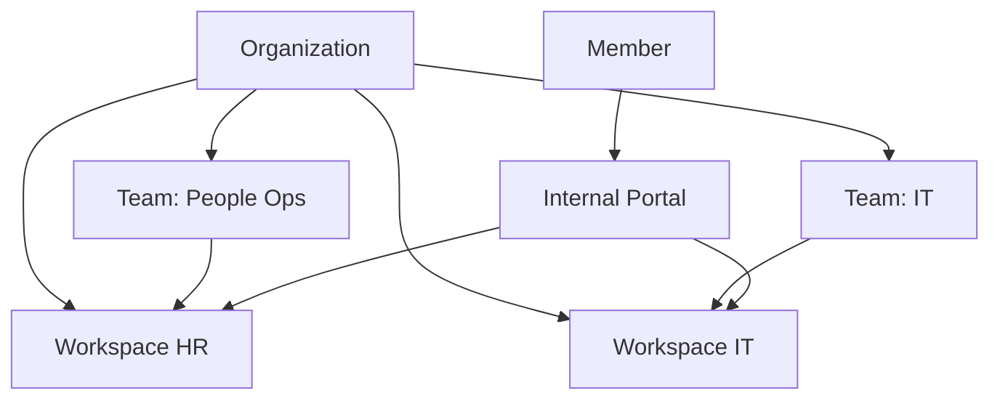

import {
  InfoBox,
  Warning,
  RelatedTopics,
  FaqAccordion,
  WorkflowCard,
} from '@site/src/components';

# Teams

**Teams** group organization Members and grant them access to specific [AI Workspaces](/docs/platform/ai-workspaces). They are the practical mechanism behind Employee AI least privilege.

## Short definition (citation-ready)

> A Team is an organization-scoped group of Members with attached workspaces. Members only see Internal Portal assistants for workspaces their Teams grant.

## How Teams relate to RBAC

| Concept | Role |
| --- | --- |
| Owner / Admin / Member | Who can configure vs who only chats |
| Team | Which workspaces a Member may use |
| Workspace | Isolated knowledge + tools |

See [RBAC](/docs/platform/rbac) and [Configure RBAC](/docs/guides/configure-rbac).

## API surfaces (org)

Typical REST routes (Owner/Admin JWT):

| Method | Path | Purpose |
| --- | --- | --- |
| GET/POST | `/api/v1/org/teams` | List / create teams |
| PUT | `/api/v1/org/teams/:id/members` | Set membership |
| PUT | `/api/v1/org/teams/:id/workspaces` | Grant workspaces |

Exact payloads: Admin Console + [REST APIs](/docs/api/rest-apis).

## Architecture

## Workflow

<WorkflowCard
  title="Grant Employee AI access"
  steps={[
    {title: 'Create Team', description: 'Name by function, not by person.'},
    {title: 'Add Members', description: 'Contractors get temporary membership.'},
    {title: 'Attach workspaces', description: 'Only what that function needs.'},
    {title: 'Verify as Member', description: 'Confirm portal list is minimal.'},
    {title: 'Review leavers', description: 'Remove Team membership promptly.'},
  ]}
/>

<Warning>
Putting everyone on one mega-team defeats least privilege. Prefer function-based Teams.
</Warning>

## FAQ

<FaqAccordion
  items={[
    {
      question: 'Do Teams affect the website widget?',
      answer:
        'No. The widget uses a workspace id + widget token. Teams gate Employee AI portal access.',
    },
    {
      question: 'Can a Member belong to multiple Teams?',
      answer:
        'Yes. They see the union of granted workspaces.',
    },
  ]}
/>

## Related topics

<RelatedTopics
  topics={[
    {label: 'RBAC', to: '/docs/platform/rbac'},
    {label: 'Organizations', to: '/docs/platform/organizations'},
    {label: 'Employee AI', to: '/docs/platform/employee-ai'},
    {label: 'Configure RBAC', to: '/docs/guides/configure-rbac'},
    {label: 'Create Employee AI', to: '/docs/guides/create-employee-ai'},
    {label: 'Tenant Isolation', to: '/docs/security/tenant-isolation'},
  ]}
/>
