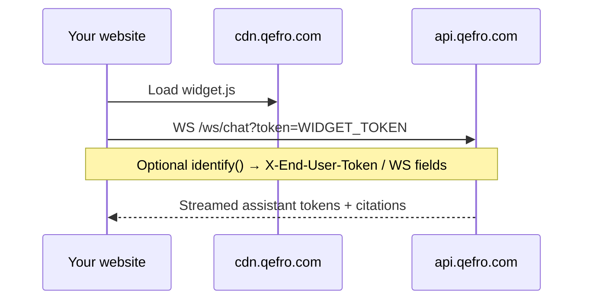

import {
  InfoBox,
  Warning,
  RelatedTopics,
  FaqAccordion,
  WorkflowCard,
} from '@site/src/components';
import Tabs from '@theme/Tabs';
import TabItem from '@theme/TabItem';

# Website Widget

The **Website Widget** is Qefro’s embeddable Customer AI chat. It loads from `https://cdn.qefro.com/widget.js` (or your configured CDN), authenticates with a **publishable widget token**, and streams replies over WebSocket (`/ws/chat`) with HTTP fallback (`POST /api/v1/widget/chat`).

## Introduction

Configure appearance and copy the embed snippet from **Admin Console → Widget**. Select a **workspace** so the live preview and embed `data-workspace-id` stay aligned.

Supported surfaces in the widget implementation:

- Text chat with streaming
- Optional lead capture
- Message feedback
- Human handoff / ticket triggers
- Voice STT/TTS via `/api/v1/widget/stt` and `/api/v1/widget/tts`
- `setContext()` for page/product context
- `identify()` for end-user identity (Business Tools)

## Why it exists

Customer AI must ship on your website without hosting RAG infra. The widget is the public channel; knowledge and tools stay on `api.qefro.com` under your tenant.

## Concepts

| Concept | Detail |
| --- | --- |
| Widget token | Publishable embed key; rotatable in Admin Console |
| `data-endpoint` | Usually `https://api.qefro.com` |
| `data-workspace-id` | Binds chat to a workspace knowledge/tools set |
| Visitor session | Continuity cookie/header separate from `identify()` |
| End-user identity | Host-owned JWT/session via `identify()` |

## Architecture



## Workflow

<WorkflowCard
  title="Deploy the widget"
  steps={[
    {title: 'Pick workspace', description: 'Admin Console → Widget → select workspace.'},
    {title: 'Copy embed', description: 'Paste script tag before </body>.'},
    {title: 'Optional identify', description: 'Call widget.identify() after your app login.'},
    {title: 'Test', description: 'Anonymous + authenticated flows; rotate token if leaked.'},
  ]}
/>

## Code examples

<Tabs>
  <TabItem value="script" label="Script tag" default>

```html
<script
  src="https://cdn.qefro.com/widget.js"
  data-token="YOUR_WIDGET_TOKEN"
  data-endpoint="https://api.qefro.com"
  data-theme="auto"
  data-position="bottom-right"
  data-primary-color="#7c3aed"
  data-welcome-message="Hi! How can we help?"
  data-workspace-id="YOUR_WORKSPACE_ID">
</script>
```

  </TabItem>
  <TabItem value="npm" label="npm / JS API">

```bash
npm install @qefro-ai/widget
```

```javascript
import { Widget } from '@qefro-ai/widget';

const widget = new Widget({
  token: 'YOUR_WIDGET_TOKEN',
  endpoint: 'https://api.qefro.com',
  theme: 'auto',
  position: 'bottom-right',
  workspaceId: 'YOUR_WORKSPACE_ID',
});

widget.open();

// Page context — NOT identity
widget.setContext({ page: '/checkout', productId: 'ABC123' });

// Authenticated end user — for Business Tools
widget.identify({
  id: user.id,
  email: user.email,
  name: user.name,
  auth: { mode: 'jwt', token: userJwt },
});

// Refresh JWT without restarting
widget.setAuthToken(newJwt);

// Logout
await widget.clearIdentity();
```

  </TabItem>
</Tabs>

Identity transport (real widget behavior):

- JWT mode → HTTP header `X-End-User-Token`, WebSocket field `endUserToken`
- Session mode → `X-End-User-Session` / `endUserSession`
- Profile fields (`id`, `email`, `name`, `authMode`) go in the request body — **tokens are never placed in the JSON body**

## Best practices

- Always set `data-workspace-id` for production embeds
- Call `identify()` only after your own auth succeeds
- Rotate the widget token if it leaks; update every embed
- Use `clearIdentity()` on logout

## Security notes

<Warning>
The widget token is publishable but still site-scoped. Do not treat it as a server API key. Business Tool secrets stay encrypted in Qefro; never embed them in the page.
</Warning>

## FAQ

<FaqAccordion
  items={[
    {
      question: 'What endpoints does the widget call?',
      answer:
        'Primary: WebSocket /ws/chat. Fallback: POST /api/v1/widget/chat. Also settings, leads, feedback, handoff, STT/TTS, and identity/clear under /api/v1/widget/*.',
    },
    {
      question: 'Is identify() required?',
      answer:
        'No for anonymous FAQ bots. Yes when Business Tools must run as a specific end user.',
    },
  ]}
/>

## Related topics

<RelatedTopics
  topics={[
    {label: 'Identity Forwarding', to: '/docs/platform/identity-forwarding'},
    {label: 'Customer AI', to: '/docs/platform/customer-ai'},
    {label: 'Business Actions', to: '/docs/platform/business-actions'},
    {label: 'Deploy Website Widget', to: '/docs/guides/deploy-website-widget'},
  ]}
/>
