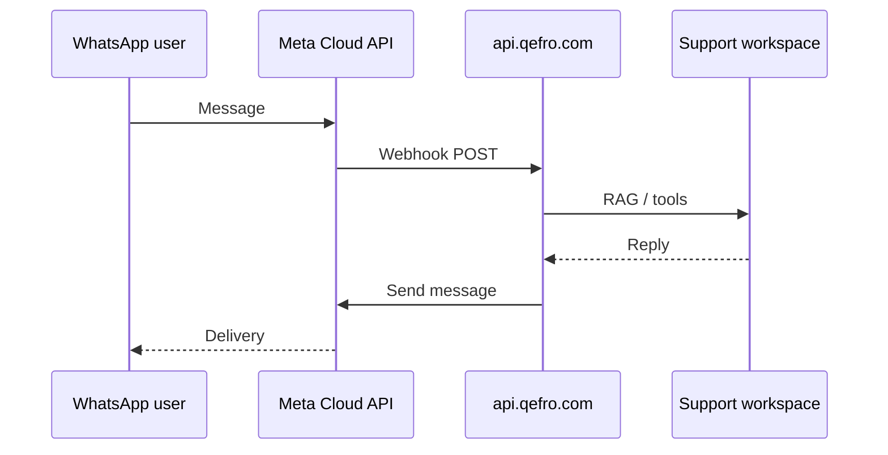

import {
  InfoBox,
  Warning,
  RelatedTopics,
  FaqAccordion,
  WorkflowCard,
} from '@site/src/components';

# WhatsApp

**WhatsApp** connects Meta Cloud API messaging to a Qefro Customer AI workspace. Availability: **Growth+**.

## Short definition (citation-ready)

> Qefro WhatsApp Customer AI receives Meta Cloud API webhooks at `api.qefro.com`, runs the bound workspace’s RAG/tools, and sends replies back through Meta.

## API routes

| Method | Path | Purpose |
| --- | --- | --- |
| GET | `/api/v1/whatsapp/webhook` | Meta verification challenge |
| POST | `/api/v1/whatsapp/webhook` | Inbound messages |

Tenant credentials and workspace mapping are configured in Admin Console (encrypted). Confirm exact field names in the console UI.

## Architecture

## Workflow

Follow the full playbook: [Deploy WhatsApp AI](/docs/guides/deploy-whatsapp-ai).

<WorkflowCard
  title="WhatsApp readiness"
  steps={[
    {title: 'Website quality first', description: 'Same Support workspace preferred.'},
    {title: 'Confirm Growth+', description: 'Plan entitlement.'},
    {title: 'Meta app + tokens', description: 'Store secrets in Qefro.'},
    {title: 'Verify webhook', description: 'GET challenge must succeed.'},
    {title: 'Pilot users', description: 'Compare answers to widget.'},
  ]}
/>

<Warning>
WhatsApp threads often contain PII. Align retention, tools, and human escalation with your privacy policy before broad rollout.
</Warning>

## FAQ

<FaqAccordion
  items={[
    {
      question: 'Can WhatsApp use a different workspace than the website?',
      answer:
        'Yes, but answer consistency usually suffers. Prefer one Support workspace.',
    },
    {
      question: 'Where do failed sends appear?',
      answer:
        'Check Meta delivery errors and Qefro conversation/tool logs for the tenant.',
    },
  ]}
/>

## Related topics

<RelatedTopics
  topics={[
    {label: 'Deploy WhatsApp AI', to: '/docs/guides/deploy-whatsapp-ai'},
    {label: 'Customer AI', to: '/docs/platform/customer-ai'},
    {label: 'Webhooks', to: '/docs/api/webhooks'},
    {label: 'Website Widget', to: '/docs/platform/website-widget'},
    {label: 'Production Deployment', to: '/docs/guides/production-deployment'},
  ]}
/>
