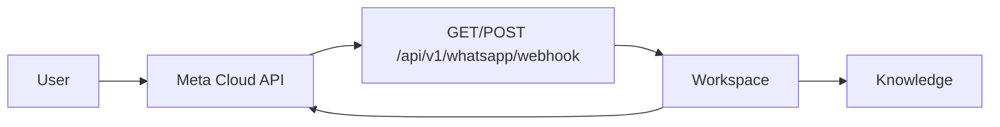

import {
  InfoBox,
  Warning,
  RelatedTopics,
  FaqAccordion,
  WorkflowCard,
} from '@site/src/components';

# WhatsApp

**WhatsApp** connects Meta Cloud API messaging to a Qefro Customer AI workspace. Availability: **Growth+**.

## Introduction

API routes:

- `GET /api/v1/whatsapp/webhook` — Meta verification challenge
- `POST /api/v1/whatsapp/webhook` — inbound messages

Tenant WhatsApp configuration is managed in the Admin Console (and platform admin WhatsApp config endpoints for operators). Phone numbers map into workspace-scoped assistants like other Customer AI channels.

## Why it exists

Customers already message businesses on WhatsApp. Reusing the same knowledge + Business Actions avoids a second bot stack.

## Concepts

- **Webhook verify token** — Meta subscription handshake
- **Phone number ID** — Cloud API sender identity
- **Workspace binding** — which knowledge/tools answer

## Architecture



## Workflow

<WorkflowCard
  title="Enable WhatsApp"
  steps={[
    {title: 'Upgrade to Growth+', description: 'WhatsApp is not on Free/Starter.'},
    {title: 'Configure Meta app', description: 'Cloud API + webhook pointing at api.qefro.com.'},
    {title: 'Map to workspace', description: 'Admin Console WhatsApp settings.'},
    {title: 'Test', description: 'Send a real message; verify citations/actions.'},
  ]}
/>

## Code examples

```bash
# Webhook URL (configure in Meta)
# https://api.qefro.com/api/v1/whatsapp/webhook
```

## Best practices

- Use the same Customer Support workspace as the website widget when you want one brain
- Keep write tools tightly scoped on messaging channels

## Security notes

<Warning>
Protect verify tokens and Cloud API secrets like production credentials. Rotate if exposed.
</Warning>

## FAQ

<FaqAccordion
  items={[
    {
      question: 'Same knowledge as the widget?',
      answer: 'Yes — if both channels bind to the same workspace.',
    },
  ]}
/>

## Related topics

<RelatedTopics
  topics={[
    {label: 'Customer AI', to: '/docs/platform/customer-ai'},
    {label: 'Deploy WhatsApp AI', to: '/docs/guides/deploy-whatsapp-ai'},
    {label: 'Website Widget', to: '/docs/platform/website-widget'},
  ]}
/>
