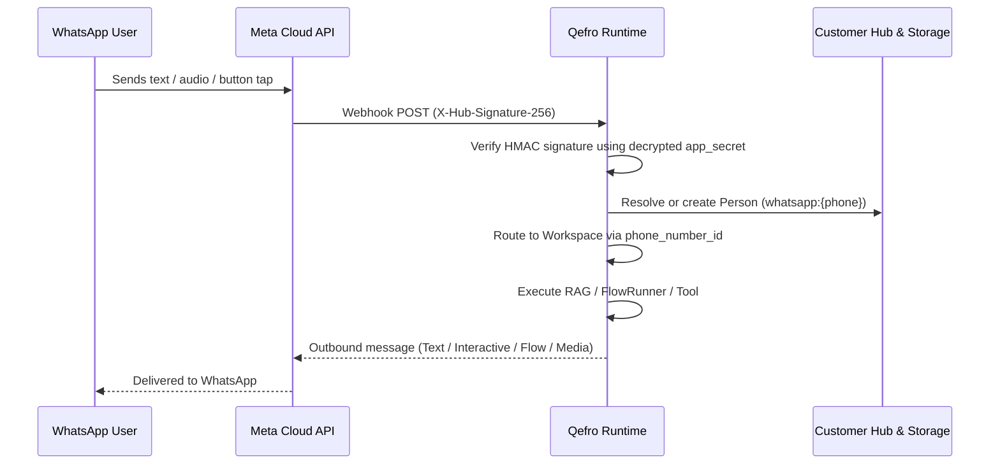

import {
  InfoBox,
  Warning,
  RelatedTopics,
  FaqAccordion,
  WorkflowCard,
} from '@site/src/components';

# WhatsApp Channel

Qefro integrates directly with Meta's **WhatsApp Cloud API** (`graph.facebook.com/v22.0`), enabling Customer AI assistants to converse, execute Business Flows, display product catalogs, and automate customer service over WhatsApp.

---

## 1. Architecture & Message Routing

Incoming customer messages arrive via Meta Cloud API webhooks at Qefro Runtime, where they are authenticated, routed to the owning workspace, and processed through the runtime pipeline:

```mermaid
sequenceDiagram
  participant U as WhatsApp User
  participant M as Meta Cloud API
  participant RT as Qefro Runtime
  participant DB as Customer Hub & Storage

  U->>M: Sends text / audio / button tap
  M->>RT: Webhook POST (X-Hub-Signature-256)
  RT->>RT: Verify HMAC signature using decrypted app_secret
  RT->>DB: Resolve or create Person (whatsapp:{phone})
  RT->>RT: Route to Workspace via phone_number_id
  RT->>RT: Execute RAG / FlowRunner / Tool
  RT-->>M: Outbound message (Text / Interactive / Flow / Media)
  M-->>U: Delivered to WhatsApp
```

---

## 2. Workspace Configuration

Each AI Workspace configures its own WhatsApp channel credentials in **Workspace Settings ➔ Channels ➔ WhatsApp**:

| Setting | Field Name | Description |
|---|---|---|
| **Phone Number ID** | `phone_number_id` | Meta WhatsApp Business phone number identifier. |
| **Permanent Access Token** | `access_token` | Meta system user token (encrypted at rest with AES-256-GCM). |
| **Verify Token** | `verify_token` | Webhook verification token for GET challenge. |
| **Meta App Secret** | `app_secret` | Used to verify `X-Hub-Signature-256` HMAC on inbound webhooks. |
| **Phone Number** | `phone_number` | International E.164 formatted number (e.g. `+14155552671`). |
| **WABA ID** | `waba_id` | WhatsApp Business Account ID (for template discovery & Embedded Signup). |

---

## 3. Webhook Security & Verification

- **Challenge Verification:** `GET /api/v1/whatsapp/webhook` verifies `hub.verify_token` against decrypted workspace tokens and returns `hub.challenge`.
- **HMAC Signatures:** Every incoming `POST /api/v1/whatsapp/webhook` payload is verified using `X-Hub-Signature-256`. Requests with missing, expired, or invalid signatures are rejected with `401 Unauthorized` before processing.
- **Message Status Webhooks:** Inbound status updates (`sent`, `delivered`, `read`, `failed`) are processed by the runtime to update conversation message statuses.

---

## 4. Conversation & Identity Mapping

- **Session Format:** Inbound conversations are mapped to `session_id = "whatsapp:{phone}"` where `{phone}` is the normalized E.164 phone number.
- **Customer Hub Person:** The sender's phone number is looked up in Customer Hub. If found, the existing `Person` record is attached; otherwise, a new Person is created with `channel: Whatsapp`.
- **Identity Injection:** When FlowRunner executes `entity.*` actions, the verified `person_id` is automatically injected into customer fields.

---

## 5. Rich Outbound Message Capabilities

Qefro Runtime formats responses to take full advantage of WhatsApp's native interactive UI surfaces:

### A. WhatsApp Flows (Structured Native Forms)
Flows defined in Marketplace Apps (`whatsapp_flow:` on workflow YAML) are compiled into native Meta WhatsApp Flows with end-to-end encryption. Users complete multi-field forms (date pickers, dropdowns, booking details) directly inside WhatsApp. When submitted, the flow resumes FlowRunner with the collected data.

### B. WhatsApp Catalog & Commerce
Entities marked with `catalog:` (e.g., menu items, properties, retail products) automatically sync to Meta Commerce Catalogs. The AI assistant can send native Product and Multi-Product Messages (MPM) that users can browse and add to cart.

### C. Interactive Buttons & Lists {#interactive-reply-buttons}
- **Reply Buttons:** Quick response buttons (up to 3) for immediate choices.
- **List Messages:** Menu lists (up to 10 items grouped in sections) for selecting services, categories, or available tables.
- **Text Chunking:** Long text responses are automatically converted from Markdown to WhatsApp format and chunked safely within WhatsApp's character boundaries (up to 4,096 characters, chunked at 1,500 bytes for optimal mobile readability).

### D. Outbound Media & Audio (STT)
- **Voice Messages (STT):** Inbound voice notes are automatically transcribed using Whisper / speech-to-text models and processed as conversational turns.
- **Media Delivery:** Outbound images, documents (PDF receipts, quotes, booking confirmations), audio, and video are dispatched via the Cloud API media endpoints.

---

## 6. System Commands & Human Escalation

- **Slash Commands:** Users can send `/new` or `/clear` to start a fresh conversation session, or `/help` to view commands.
- **Human Handoff:** Workflows can execute the `handoff` step, which marks the conversation state as transferred to a human agent, pauses AI responses, and alerts staff in the Inbox.

---

## Related Documentation

- [Deploy WhatsApp AI Guide](/docs/guides/deploy-whatsapp-ai)
- [WhatsApp Commerce Playbook](/docs/solutions/whatsapp-commerce)
- [Customer Hub & Person Identity](/docs/solutions/customer-hub)
- [FlowRunner Architecture](/docs/developer/concepts/flows)
