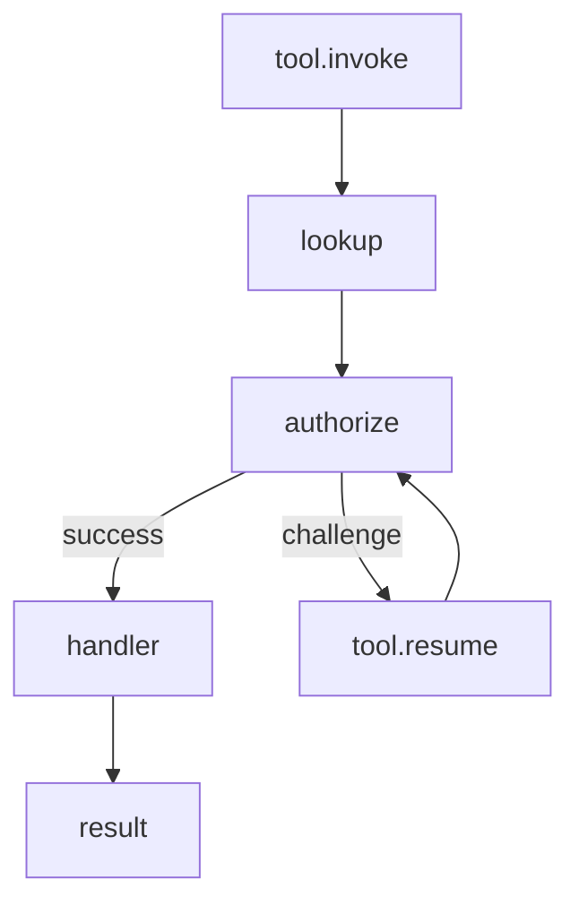

The Qefro Backend Framework (`@qefro-ai/backend` for TypeScript, `qefro-backend-sdk` for Rust) is how organizations register **Business Tool handlers** and own customer authentication.

Qefro calls your backend over one signed webhook (typically `POST /qefro`). You never implement `/auth/evaluate` on Qefro — auth lives inside your handlers.

## Install

### TypeScript (npm)

```bash
npm install @qefro-ai/backend
```

[npmjs.com/package/@qefro-ai/backend](https://www.npmjs.com/package/@qefro-ai/backend)

### Rust (crates.io)

```bash
cargo add qefro-backend-sdk
```

```toml
[dependencies]
qefro-backend-sdk = "1"
```

[crates.io/crates/qefro-backend-sdk](https://crates.io/crates/qefro-backend-sdk) · [docs.rs](https://docs.rs/qefro-backend-sdk)

```bash
export QEFRO_SIGNING_SECRET="your-signing-secret"
```

## Framework lifecycle

1. `new Qefro({ signingSecret })`
2. Optional middleware (`app.use`)
3. Customer Provider (`app.customer({ lookup, authorize })`)
4. Tool registration (`app.tool(definition, handler)`)
5. `app.listen({ port, path: '/qefro' })`

## Register Business Tools

Every `app.tool(...)` becomes discoverable via `tools.list`. After you create an **SDK Connection** in Admin Console and run **Sync Tools** with a workspace, those handlers become workspace Business Tools (`implementation_kind = sdk`).

```ts
import { Qefro } from '@qefro-ai/backend';

const app = new Qefro({ signingSecret: process.env.QEFRO_SIGNING_SECRET! });

app.customer({
  async lookup(ctx) {
    return { id: String(ctx.identity.phone ?? 'demo') };
  },
  async authorize(ctx) {
    return {
      kind: 'success',
      customer: ctx.customer,
      auth: { type: 'bearer_token', access_token: 'dev', expires_in: 900 },
    };
  },
});

app.tool(
  {
    name: 'get_orders',
    description: 'List orders for the authenticated customer',
    auth: 'required',
    input_schema: {
      type: 'object',
      properties: {},
    },
  },
  async (ctx) => {
    return [{ orderId: 'ord_1', customerId: String(ctx.customer.require().id) }];
  },
);

await app.listen({ port: 8088, path: '/qefro' });
```

### Tool definition fields

| Field | Description |
| --- | --- |
| `name` | Unique handler name (synced as `sdk_handler_name`) |
| `description` | LLM-facing description |
| `input_schema` | JSON Schema for parameters |
| `auth` | `none` \| `optional` \| `required` |
| `authentication_methods` | e.g. `['email_otp']` — non-empty → Sync sets organization challenge |
| `permissions` | Checked in your SDK |
| `timeout` | Handler timeout hint (seconds) |

Full console + API walkthrough: [Register SDK Business Tools](/docs/guides/register-sdk-business-tools).

### Rust (crates.io)

```toml
[dependencies]
qefro-backend-sdk = "1"
tokio = { version = "1", features = ["macros", "rt-multi-thread"] }
serde_json = "1"
anyhow = "1"
async-trait = "0.1"
```

```rust
use anyhow::Result;
use async_trait::async_trait;
use qefro_backend_sdk::{
    AuthOutcome, AuthenticationContextPayload, CustomerAuthorizeContext, CustomerLookupContext,
    CustomerProvider, ListenOptions, Qefro, QefroConfig, ToolAuthMode, ToolMetadata,
};
use serde_json::{json, Value};

struct DemoCustomer;

#[async_trait]
impl CustomerProvider for DemoCustomer {
    async fn lookup(&self, ctx: &CustomerLookupContext) -> Result<Option<Value>> {
        Ok(Some(json!({ "id": "demo" })))
    }

    async fn authorize(&self, ctx: &CustomerAuthorizeContext) -> Result<AuthOutcome> {
        Ok(AuthOutcome::Success {
            customer: ctx.customer.clone(),
            auth: AuthenticationContextPayload {
                credential_type: Some("bearer_token".into()),
                access_token: Some("dev".into()),
                credential: None,
                refresh_token: None,
                expires_in: Some(900),
                customer_id: Some("demo".into()),
            },
        })
    }
}

#[tokio::main]
async fn main() -> Result<()> {
    let mut app = Qefro::new(QefroConfig::new(std::env::var("QEFRO_SIGNING_SECRET")?));
    app.customer(DemoCustomer);
    app.tool(
        ToolMetadata {
            name: "get_orders".into(),
            description: Some("List orders".into()),
            auth: ToolAuthMode::Required,
            ..Default::default()
        },
        |_ctx| async move { Ok(json!([{ "orderId": "ord_1" }])) },
    );
    let handle = app
        .listen(ListenOptions {
            port: 8088,
            host: None,
            path: Some("/qefro".into()),
        })
        .await?;
    println!("{}", handle.url);
    Ok(())
}
```

More: [github.com/qefro-ai/qefro-rust-backend-sdk/examples](https://github.com/qefro-ai/qefro-rust-backend-sdk/tree/main/examples).

## Protocol

| Type | Direction | Purpose |
| --- | --- | --- |
| `ping` | Qefro → you | Health / Test Connection |
| `tools.list` | Qefro → you | Discovery / Sync Tools |
| `tool.invoke` | Qefro → you | Execute a handler |
| `tool.resume` | Qefro → you | Continue after customer challenge reply |

Headers: `X-Qefro-Protocol: 1`, `X-Qefro-SDK`, `X-Qefro-Version`, plus HMAC signature headers. `app.listen()` verifies signatures and routes messages.

## Request lifecycle



## Connect to Qefro Admin Console

1. Deploy webhook at HTTPS.
2. **Business Tools → SDK Connections → Add Connection** (webhook URL + signing secret).
3. **Test Connection** (`ping`).
4. Select a workspace → **Sync Tools** (`tools.list` + auto-register).

APIs:

- `POST /api/v1/org/sdk-connections`
- `POST /api/v1/org/sdk-connections/:id/test`
- `POST /api/v1/org/sdk-connections/:id/sync-tools` with `{ "workspace_id", "auto_register": true }`

## Deployment

Expose `POST /qefro` behind HTTPS with stable secret management. Rotate secrets from Admin Console and update `QEFRO_SIGNING_SECRET` together.

See also: [Business Tools](/docs/v1/business-tools), [Customer Provider](/docs/v1/customer-provider), [Examples](/docs/v1/examples) ([JS](https://github.com/qefro-ai/qefro-js-backend-sdk/tree/main/examples) · [Rust](https://github.com/qefro-ai/qefro-rust-backend-sdk/tree/main/examples)).
